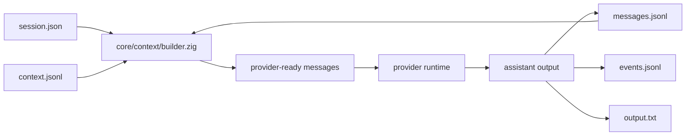

# VAR1 New Chat Dump - 2026-04-28

## Resume Prompt For Next Chat

You are working in `E:\Workspaces\01_Projects\01_Github\VANTARI-ONE`.

Read these files before editing:

- `AGENTS.md`
- `.docs/handoff/2026-04-28-var1-new-chat-dump.md`
- `README.md`
- `apps/backend/variant-1/README.md`
- `apps/backend/variant-1/architecture.md`

Start every new user turn with `user-message-logger` and `recon-intel`.
Use `iex` for repository search in this checkout.
Do not reintroduce `.harness`, `.var/tasks`, old migration readers, `/api/tasks*` compatibility, `rg_search`, flat `src/*.zig` runtime files, or root-level flat `VAR1` aliases.

## Current Objective

VANTARI-ONE currently has one live runtime lane: `apps/backend/variant-1`.
`VAR1` is the Zig agent-harness kernel. CLI and browser clients operate the same project-local `.var/sessions` state through the protocol surface.

The active cleanup direction is forward-only:

- no backward-compatible pre-session migration readers
- no old root aliases
- no bridge-level task facade
- no duplicated context assembly path
- no plugin loader theater before real plugin runtime requirements exist

## Canonical Runtime Contract

```text
.var/sessions/<session-id>/
  session.json
  messages.jsonl
  context.jsonl
  events.jsonl
  output.txt
```

Artifact semantics:

- `session.json` is lifecycle and runtime metadata.
- `messages.jsonl` is the complete durable user/assistant transcript for session history, UI rendering, and operator review.
- `context.jsonl` is the compacted/model-ready checkpoint history. It is not a second transcript.
- `events.jsonl` is runtime progress, tool lifecycle, bridge, and terminal event history.
- `output.txt` is the latest terminal assistant output only. It must not be used to reconstruct model context.

## Architecture State

Root namespace:

```zig
pub const shared = @import("shared/index.zig");
pub const core = @import("core/index.zig");
pub const host = @import("host/index.zig");
pub const clients = @import("clients/index.zig");
```

Kernel ownership:

- `VAR1.core.context` owns provider message construction.
- `VAR1.core.sessions` owns `.var/sessions` storage.
- `VAR1.core.executor` owns session execution flow.
- `VAR1.core.tools` owns built-in tools and typed tool sockets.
- `VAR1.core.plugins` owns plugin manifest/socket validation only.
- `VAR1.host.stdio_rpc` owns JSON-RPC 2.0 over stdio with `Content-Length` framing.
- `VAR1.host.http_bridge` owns `/rpc`, `/events`, and `/api/health`.
- `VAR1.clients.cli` owns argument parsing, formatting, and hidden host spawning.

Current source hierarchy:

```text
apps/backend/variant-1/src/
  root.zig
  shared/
    index.zig
    types.zig
    fsutil.zig
    protocol/
  core/
    agents/
    auth/
    config/
    context/
    docs/
    executor/
    plugins/
    providers/
    sessions/
    tools/
  host/
    index.zig
    stdio_rpc.zig
    http_bridge.zig
  clients/
    index.zig
    cli.zig
```

## Session And Context Flow



The context builder is the only owner allowed to compile model-visible messages.
It reads the latest valid checkpoint from `context.jsonl`.
If a checkpoint exists, it emits:

- runtime/system context from the execution path
- one compacted summary message
- raw transcript messages with `seq >= first_kept_seq`

If no checkpoint exists, it emits the raw transcript from `messages.jsonl`.

## What Was Just Cleaned

The current working tree contains a broad in-flight refactor. Do not interpret the dirty tree as accidental.

Completed cleanup:

- root API narrowed to `VAR1.shared`, `VAR1.core`, `VAR1.host`, and `VAR1.clients`
- flat runtime files moved behind `core/`, `shared/`, `host/`, and `clients/`
- session store reads only `.var/sessions/<id>/messages.jsonl` for transcript state
- `ParsedSessionMessage.id` and `seq` are required
- legacy transcript reconstruction from `output.txt` or lineage has been removed
- `context.jsonl` checkpoint consumption is wired through `core/context/builder.zig`
- `rg_search` alias and stale `canonicalToolName` path are removed
- `search_files` is the content-search tool backed by the external `iex` executable; `list_files` remains native Zig discovery
- tool wording is normalized away from `task` where it was runtime-facing
- `serve` help exposes `/rpc`, `/events`, and `/api/health`
- `/api/tasks*` exists only in tests that assert removed/not-found behavior
- public docs now state the session-native architecture and current `62/62` validation count

## Reference Findings

Local references already reviewed:

- `.refs/badlogic__pi-mono/packages/coding-agent/src/core/compaction/compaction.ts`
- `.refs/badlogic__pi-mono/packages/agent/src/types.ts`
- `.refs/openai__codex/codex-rs/app-server/README.md`
- `.refs/openai__codex/codex-rs/codex-api/README.md`

Useful patterns to copy:

- Pi-style checkpoint boundaries: compact older context, preserve a recent raw suffix, and make the cutpoint explicit.
- Pi-style transform seam: keep a single context transform boundary before provider conversion.
- Codex-style protocol visibility: compaction should be an explicit session operation, not invisible opportunistic mutation.

Patterns not to copy:

- extension-tree sprawl
- global home-scoped project directory session IDs
- multiple context reconstruction paths
- large plugin loader machinery before plugin loading is a real shipped capability
- bundled-tool claims before command-backed dependencies such as `iex` are checked or packaged

## Validation Snapshot

Last recorded Windows validation:

```text
cd apps/backend/variant-1
.\scripts\zigw.ps1 build test --summary all  -> 62/62 tests passed
.\scripts\health.ps1                         -> status: ready
git diff --check                              -> clean, with CRLF conversion warnings from Git
```

Current drift scans performed for this dump:

```text
iex search "harness" apps/backend/variant-1/src apps/backend/variant-1/tests          -> 0 matches
iex search "legacy" apps/backend/variant-1/src apps/backend/variant-1/tests           -> 0 matches
iex search "fallback" apps/backend/variant-1/src apps/backend/variant-1/tests         -> 0 matches
iex search "rg_search" apps/backend/variant-1/src apps/backend/variant-1/tests        -> 0 matches
iex search "canonicalToolName" apps/backend/variant-1/src apps/backend/variant-1/tests -> 0 matches
iex search "api/tasks" apps/backend/variant-1/src apps/backend/variant-1/tests         -> only negative route-removal tests
```

## Dirty Working Tree Warning

The tree is intentionally dirty from the current architecture slice.

High-signal changed groups:

- `.docs/` logs, changelog, and pending planning artifacts
- root `AGENTS.md` and `README.md`
- `apps/backend/variant-1/README.md` and `architecture.md`
- `apps/backend/variant-1/src/root.zig`
- new nested backend hierarchy under `src/shared/`, `src/core/`, `src/host/`, and `src/clients/`
- deleted flat runtime files under `apps/backend/variant-1/src/*.zig`
- tests updated to canonical namespaces and removed compatibility expectations

Do not use `git reset`, `git checkout --`, or broad cleanup commands.
If staging later, stage only the intended slice after reviewing `git status --short`.

## Current Compaction State

Manual compaction generation is implemented through `session/compact`.

The current repo has the full storage, generation, and consumption seam:

- `messages.jsonl` is complete transcript input and remains append-only.
- `context.jsonl` has append/read checkpoint support.
- `core/context/compactor.zig` writes entry-aware checkpoints from stable message sequence ranges.
- `core/context/builder.zig` consumes the latest checkpoint and keeps the raw suffix model-visible.

The compact primitive supports bounded JSONL-row advancement through `max_entries_per_checkpoint` and higher-aggression recompaction through the public `aggressiveness` slider.
3. Select a source range from `messages.jsonl` using stable `seq`.
4. Generate one structured summary checkpoint.
5. Append that checkpoint to `context.jsonl`.
6. Prove builder consumption from `first_kept_seq`.
7. Add focused tests for checkpoint range, invalid checkpoint skipping, and raw-suffix preservation.
8. Add CLI/RPC exposure only after the kernel method is green.

Auto-compaction comes later after token accounting and cancellation behavior are proven.

## Do Not Do

- Do not restore `.harness`.
- Do not add migration readers for old task layouts.
- Do not preserve `/api/tasks*` compatibility.
- Do not rebuild task-native vocabulary inside the kernel.
- Do not let CLI, HTTP bridge, provider adapters, or executor manually assemble chat history.
- Do not create a plugin loader until manifest validation, explicit enablement, deterministic load order, and lifecycle tests are in scope.
- Do not use `output.txt` as transcript state.
- Do not change the project-local `.var/sessions/<id>/` contract into a global Codex/Claude home-store clone.

## Resume Commands

```powershell
cd E:\Workspaces\01_Projects\01_Github\VANTARI-ONE
git status --short
Get-Content AGENTS.md -TotalCount 120
Get-Content .docs\handoff\2026-04-28-var1-new-chat-dump.md
iex search "session/compact" apps/backend/variant-1/src apps/backend/variant-1/tests --max-hits 50
iex search "context.jsonl" apps/backend/variant-1/src apps/backend/variant-1/tests --max-hits 50
```

Validation commands:

```powershell
cd E:\Workspaces\01_Projects\01_Github\VANTARI-ONE\apps\backend\variant-1
.\scripts\zigw.ps1 build test --summary all
.\scripts\health.ps1
```

## Cold-Start Read Order

1. `AGENTS.md`
2. `.docs/handoff/2026-04-28-var1-new-chat-dump.md`
3. `apps/backend/variant-1/architecture.md`
4. `apps/backend/variant-1/src/root.zig`
5. `apps/backend/variant-1/src/core/index.zig`
6. `apps/backend/variant-1/src/core/context/builder.zig`
7. `apps/backend/variant-1/src/core/sessions/store.zig`
8. `apps/backend/variant-1/src/shared/types.zig`
9. `apps/backend/variant-1/src/shared/protocol/types.zig`
10. `apps/backend/variant-1/tests/core_store_test.zig`
