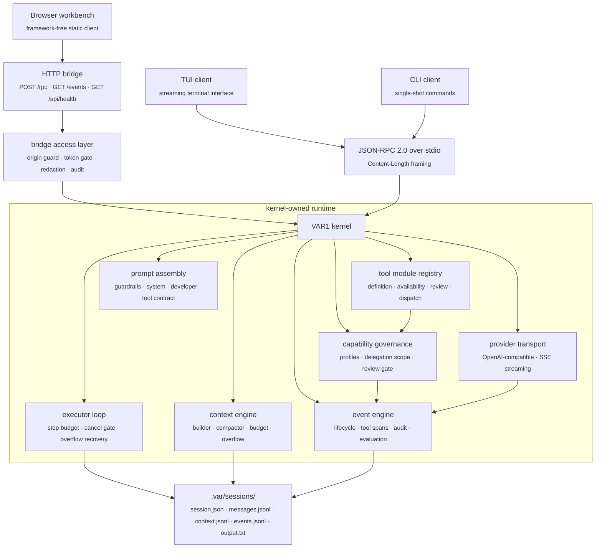
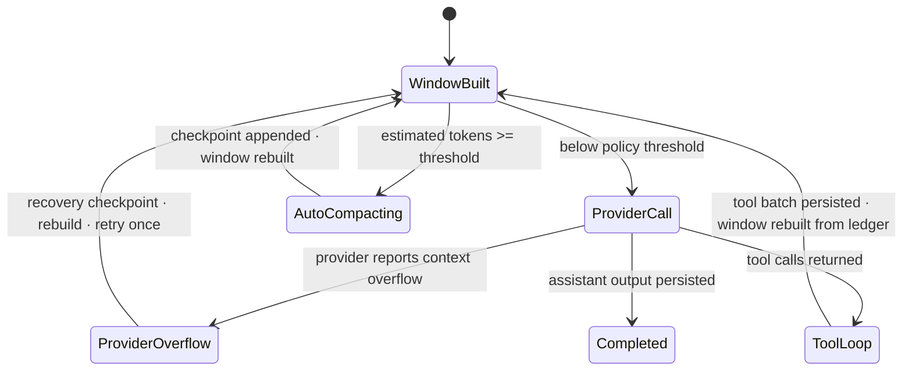
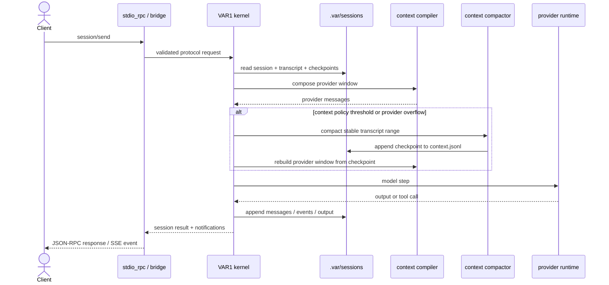
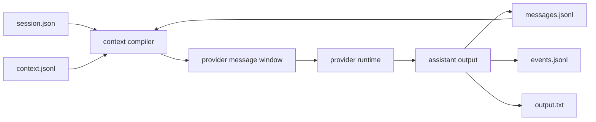

<div align="center">

# VANTARI-ONE

### Local Agent Kernel · Zig Runtime · Zero Dependencies

A single static binary that runs LLM agent sessions with append-only transcript ledgers,<br/>
deterministic context compaction, typed tool governance, cryptographic effect verification,<br/>
and multi-client ingress over one coherent protocol.

<br/>

[](https://github.com/savageops/VANTARI-ONE/releases/latest)
[](https://github.com/savageops/VANTARI-ONE/releases)
[](#validation)
[](https://ziglang.org/)
[](./LICENSE)

[](https://github.com/savageops/VANTARI-ONE/stargazers)
[](https://github.com/savageops/VANTARI-ONE/issues)
[](https://github.com/savageops/VANTARI-ONE/commits/main)

<br/>

[Why Ventari](#why-ventari) · [Architecture](#architecture) · [Quick Start](#quick-start) · [Tool Catalog](#tool-catalog) · [Protocol](#protocol) · [Session Model](#session-model) · [Security](#security) · [Configuration](#configuration) · [Built For](#built-for) · [Roadmap](#roadmap)

</div>

---

<br/>

## Why Ventari

Most agent frameworks treat an LLM session as disposable chat text — messages accumulate in memory, tool calls fire without review, context silently truncates, and nothing survives a process restart. When something goes wrong, there is no ledger, no evidence trail, and no way to replay what happened.

Ventari treats an agent session as a **replayable execution graph**. Every run produces a durable session directory with an append-only transcript, structured context checkpoints, typed tool lifecycle events, and cryptographic effect receipts for file mutations. The kernel owns the execution — clients observe and control it over a protocol surface.

**The result:** agent sessions that are dependable, inspectable, resumable, and worth returning to.

<br/>

<table>
<tr>
<td width="50%">

**What you get**
- One compiled binary, zero runtime dependencies
- Sessions that survive restarts, crashes, and context overflow
- Every tool call reviewed before side effects execute
- SHA-256 effect receipts for file mutations
- Append-only audit trail for every session
- Any OpenAI-compatible provider — cloud or local

</td>
<td width="50%">

**What you don't need**
- No Python, Node.js, or package manager
- No Docker, no containers, no orchestrator
- No cloud account or vendor lock-in
- No database server or external state store
- No framework coupling or build pipeline
- No trust-all tool execution model

</td>
</tr>
</table>

<br/>

## How It Works

The kernel is a state machine. Each step builds a provider-ready context window from the durable transcript, sends it to the model, reviews any tool calls against the compiled capability catalog, executes approved effects, persists everything, and loops.

```text
operator input ─► transcript ledger ─► context compiler ─► provider stream
                                                         ─► assistant deltas / tool calls
                                                         ─► review gate ─► approved effects
                                                         ─► typed events ─► terminal state
```

Every transition produces durable evidence. Tool calls generate `tool_requested` → `tool_reviewed` → `tool_completed` or `tool_blocked` event chains. File mutations generate `var1.tool_effect.v1` receipts with before/after byte counts and SHA-256 hashes. Context compaction generates structured checkpoints without rewriting the transcript. Nothing is silent.

<br/>

## At a Glance

| Metric | Value |
|---|---|
| **Runtime** | Single static Zig binary — `VAR1` / `vantari` |
| **Codebase** | ~45,000 lines of Zig across kernel, CLI, and TUI |
| **Reliability** | Full state-transition coverage across kernel, protocol, and client surfaces |
| **Dependencies** | Zero runtime. Zig standard library only. |
| **Provider** | Any OpenAI-compatible endpoint — GPT, Claude, Gemini, LLaMA, Mistral, local models |
| **Clients** | Native streaming TUI · CLI · Framework-free browser workbench |
| **Protocol** | JSON-RPC 2.0 over stdio with Content-Length framing |
| **Session storage** | Filesystem JSONL ledgers at `.var/sessions/<id>/` |
| **Platform** | Windows-native first class; Linux/macOS via Zig cross-compilation |

<br/>

## Architecture


```mermaid
flowchart TB
  tui["TUI client<br/><sub>streaming terminal interface</sub>"]
  cli["CLI client<br/><sub>single-shot commands</sub>"]
  browser["Browser workbench<br/><sub>framework-free static client</sub>"]

  tui --> stdio["JSON-RPC 2.0 over stdio<br/><sub>Content-Length framing</sub>"]
  cli --> stdio
  browser --> bridge["HTTP bridge<br/><sub>POST /rpc · GET /events · GET /api/health</sub>"]

  bridge --> access["bridge access layer<br/><sub>origin guard · token gate · redaction · audit</sub>"]
  access --> kernel
  stdio --> kernel["VAR1 kernel"]

  subgraph core["kernel-owned runtime"]
    kernel --> executor["executor loop<br/><sub>step budget · cancel gate · overflow recovery</sub>"]
    kernel --> context["context engine<br/><sub>builder · compactor · budget · overflow</sub>"]
    kernel --> toolruntime["tool module registry<br/><sub>definition · availability · review · dispatch</sub>"]
    kernel --> governance["capability governance<br/><sub>profiles · delegation scope · review gate</sub>"]
    kernel --> prompts["prompt assembly<br/><sub>guardrails · system · developer · tool contract</sub>"]
    kernel --> provider["provider transport<br/><sub>OpenAI-compatible · SSE streaming</sub>"]
    kernel --> events["event engine<br/><sub>lifecycle · tool spans · audit · evaluation</sub>"]
  end

  executor --> store[".var/sessions/<br/><sub>session.json · messages.jsonl · context.jsonl · events.jsonl · output.txt</sub>"]
  context --> store
  events --> store
  governance --> events
  toolruntime --> governance
  provider --> events
```

Three client surfaces — TUI, CLI, browser — send requests into the same kernel runtime. Session state, transcript assembly, provider interaction, tool dispatch, capability governance, and event emission stay inside the Zig binary. No client owns runtime state.

<br/>

### Layered Kernel Design

```text
┌──────────────────────────────────────────────────────────────────┐
│  CLIENT LAYER              TUI · CLI · Browser workbench        │
├──────────────────────────────────────────────────────────────────┤
│  HOST LAYER                stdio RPC · HTTP bridge · audit      │
├──────────────────────────────────────────────────────────────────┤
│  EXECUTOR LAYER            loop · step budget · cancel gate     │
├──────────────────────────────────────────────────────────────────┤
│  CONTEXT ENGINE            builder · compactor · budget · overflow│
├──────────────────────────────────────────────────────────────────┤
│  TOOL RUNTIME              registry · review · dispatch · effects│
├──────────────────────────────────────────────────────────────────┤
│  GOVERNANCE                profiles · delegation scope · memory  │
├──────────────────────────────────────────────────────────────────┤
│  PROVIDER TRANSPORT        OpenAI-compatible · SSE · overflow    │
├──────────────────────────────────────────────────────────────────┤
│  SESSION STORE             .var/ filesystem ledgers (JSONL)      │
└──────────────────────────────────────────────────────────────────┘
```

Each layer has a single canonical owner. The context engine never writes to the provider. The tool runtime never writes to the transcript. The provider never reads from the session store. Dependencies flow downward. State flows through explicit function parameters, never globals.

<br/>

## Quick Start

### Build and run the kernel

```powershell
cd apps/backend
.\scripts\zigw.ps1 build test --summary all    # compile + validate
.\scripts\health.ps1                            # verify provider readiness
.\zig-out\bin\VAR1.exe run --prompt "Count the lowercase letter r in strawberry."
```

### Install the CLI with streaming TUI

```powershell
cd apps/cli
.\scripts\install-var.ps1
vantari c                                       # launch interactive TUI session
```

`vantari` resolves the workspace from the terminal's current directory. Provider credentials live in the installed profile — running from any project directory works without copying auth config.

```powershell
vantari workspace show                          # display active workspace
vantari workspace set <path>                    # pin a specific workspace
vantari workspace clear                         # return to directory-based resolution
```

### Launch the browser workbench

```powershell
.\zig-out\bin\VAR1.exe serve --host 127.0.0.1 --port 4310
```

Open [`apps/frontend/var1-client/index.html`](./apps/frontend/var1-client/index.html) from a local HTTP server and point it at `http://127.0.0.1:4310`.

<br/>

## Core Capabilities

### Session-Native Execution

Every agent run is a **session** — a durable execution unit with its own transcript ledger, context checkpoints, event history, and terminal output. Sessions survive process restarts, context overflow, and provider failures. They can be created, resumed, compacted, cancelled, and inspected through the protocol surface.

```text
session/create ─► session/send ─► [executor loop] ─► session/get
                                                    ─► session/compact
                                                    ─► session/send (follow-up)
```

### Context Compaction Engine

The context engine uses a **WAL + checkpoint** model borrowed from database architecture. The transcript (`messages.jsonl`) is the append-only write-ahead log — it is never modified. Context checkpoints (`context.jsonl`) are structured summaries that constrain the model-visible window without rewriting history.


```mermaid
stateDiagram-v2
  [*] --> WindowBuilt
  WindowBuilt --> ProviderCall: below policy threshold
  WindowBuilt --> AutoCompacting: estimated tokens >= threshold
  AutoCompacting --> WindowBuilt: checkpoint appended · window rebuilt
  ProviderCall --> ProviderOverflow: provider reports context overflow
  ProviderOverflow --> WindowBuilt: recovery checkpoint · rebuild · retry once
  ProviderCall --> ToolLoop: tool calls returned
  ToolLoop --> WindowBuilt: tool batch persisted · window rebuilt from ledger
  ProviderCall --> Completed: assistant output persisted
```

Compaction never splits an assistant tool-call batch from its results. If the proposed suffix boundary falls inside a tool-call sequence, the compactor retracts to keep the batch intact. Manual and automatic compaction share the same primitive — the executor triggers it on budget threshold or provider overflow; operators trigger it via `session/compact` with configurable aggressiveness.

### Tool Governance

Tool calls pass through a **compiled review gate** before side effects execute. The kernel classifies each call from the active `ToolDefinition` catalog's `review_risk` metadata — not from prompting, not from a separate reviewer agent, and not from runtime heuristics.

| Risk class | Behavior | Tools |
|---|---|---|
| `read_only` | Approved through evidence path | `read_file` · `list_files` · `search_files` · `skill_info` · agent query tools |
| `write_capable` | Pre-dispatch review with effect receipt | `write_file` · `append_file` · `replace_in_file` |
| `command_execution` | Pre-dispatch review with bounded output | `shell_exec` |
| `delegating` | Scoped delegation validation | `launch_agent` |
| `unknown_high_impact` | **Blocked before dispatch** | Any undeclared or context-unavailable tool |

Unknown tool names, hallucinated tools, and context-unavailable tools are denied at the binary level with a protocol-visible denial result. The durable event chain is always `tool_requested` → `tool_reviewed` → `tool_completed` or `tool_blocked`.

### Cryptographic Effect Verification

Write-capable file tools return typed **effect receipts** with schema `var1.tool_effect.v1`:

```json
{
  "schema_version": "var1.tool_effect.v1",
  "operation": "write_file",
  "requested_path": "src/main.zig",
  "resolved_path": "/workspace/src/main.zig",
  "before": { "exists": true, "bytes": 1024, "sha256": "a1b2c3..." },
  "after":  { "exists": true, "bytes": 1280, "sha256": "d4e5f6..." }
}
```

The model sees proof of its own side effects before continuing. The harness sees deterministic file-effect evidence without a separate verifier worker. Every file mutation is priced in bytes and hashed — not trusted on faith.

### Streaming TUI

The installed `vantari` client renders a full terminal interface with:

- **Real-time token streaming** — assistant deltas render character-by-character as they arrive
- **One-row tool span updates** — tool execution shows inline progress without scrolling the transcript
- **Bounded command output** — `shell_exec` stdout/stderr streams into the TUI with configurable caps
- **Scrollback** — Page Up/Down, Ctrl+Home/End for full transcript navigation
- **Session continuation** — `vantari -c` resumes the latest session with full transcript hydration
- **Concurrent execution model** — RPC runs on a background thread; the main thread handles UI events, polls notifications at 60ms, and syncs durable state at 350ms intervals

### Scoped Delegation

Child agents are not autonomous. `launch_agent` carries explicit scope fields that the kernel validates before spawning a child session:

| Field | Contract |
|---|---|
| `scope_depth` | Maximum delegation depth; zero-value scope rejected |
| `contact_budget` | Parent supervision limit for the child lifecycle |
| `validation_status` | `unverified` · `self_checked` · `validated` |
| `escalation_reason` | Required for scope expansion beyond default profile |
| `parent_capability_profile` | Inherited runtime boundary for tool classes and budgets |

Two capability profiles — `root` and `subagent` — define typed runtime boundaries over tool classes, delegation policy, budget policy, and provider inheritance. They are not product roles or prompt taxonomy.

### Skill Routing

The system prompt carries compact summaries of native skill protocols. The `skill_info` tool returns exact capsules on demand so the model routes into a skill without injecting every skill body into every prompt.

| Skill | Purpose |
|---|---|
| `planning-spec` | Deterministic execution chains, invariant tracking, cold-start handoff |
| `insect` | Compiled Rust web/search/scrape runtime for external research |
| `dupe-audit` | Similarity and duplication audit for regression gates |
| `recon-intel` | Structured repository reconnaissance before architecture changes |
| `ux-playbook` | Enterprise UI/UX structure, hierarchy, and workflow review |
| `t3-tape` | PatchMD workflow for patch stream governance |
| `repo-harvester` | Repository harvest, qualify, archive, and index operations |
| `playwright` | Real browser automation for UI flows and visual verification |
| `task-audit` | Implementation correctness review for drift and violations |

<br/>

## Tool Catalog

Nine built-in tool modules, each exporting a typed `definition`, `availability` spec, and `execute` contract:

| Tool | Risk | Description |
|---|---|---|
| `read_file` | `read_only` | Bounded text read from workspace-relative paths |
| `list_files` | `read_only` | Native Zig directory and file discovery — no external dependencies |
| `search_files` | `read_only` | Content search via external `iex` binary with structured JSON output; probes availability at startup |
| `write_file` | `write_capable` | Atomic file creation/overwrite with `var1.tool_effect.v1` receipt and SHA-256 verification |
| `append_file` | `write_capable` | Additive writes for ledgers and large artifact chunking with effect receipt |
| `replace_in_file` | `write_capable` | Targeted find-replace with before/after verification and effect receipt |
| `shell_exec` | `command_execution` | Bounded command execution — `argv` · `shell` · `bash` · `powershell` modes with timeout, output caps, and streaming |
| `skill_info` | `read_only` | Skill capsule retrieval for protocol routing without prompt pollution |
| `launch_agent` | `delegating` | Scoped child-session creation with capability profile validation |

**Agent orchestration tools** for parent-supervised child lifecycle:

| Tool | Description |
|---|---|
| `agent_status` | Non-blocking child session snapshot |
| `wait_agent` | Blocking wait with configurable `timeout_ms` |
| `list_agents` | Enumerate parent's active children |

All tool definitions are schema-first. The registry resolves availability from module-owned specs — `search_files` probes the `iex` executable at startup and reports unavailable if absent, rather than failing at invocation time. `tools/list` and `VAR1 tools --json` expose the same catalog with availability metadata, examples, and usage hints.

**Bounded payloads:** File tool content arguments are capped at 8KB. Shell output capture is capped at 64KB per stream. Violations return `ToolPayloadExceeded` with repair hints instead of silent truncation.

<br/>

## Protocol

The kernel exposes JSON-RPC 2.0 methods over stdio. Browser clients reach the same methods through the HTTP bridge.

| Method | Operation |
|---|---|
| `initialize` | Server version and capability flags |
| `health/get` | Readiness, provider status, workspace, and auth metadata |
| `session/create` | Initialize a new session record |
| `session/resume` | Load an existing session into runtime state |
| `session/send` | Append user input, compile context, auto-compact if needed, and advance execution |
| `session/compact` | Write a manual context checkpoint from stable message sequence ranges |
| `session/cancel` | Mark cancellation intent for a running session |
| `session/get` | Return session summary, messages, and events |
| `session/list` | Return known session summaries |
| `tools/list` | Return the tool catalog in text or JSON format |
| `events/subscribe` | Enable `session/event` notifications |

<details>
<summary><strong>Session execution sequence</strong></summary>


```mermaid
sequenceDiagram
  actor Client
  participant Host as stdio_rpc / bridge
  participant Kernel as VAR1 kernel
  participant Store as .var/sessions
  participant Builder as context compiler
  participant Compactor as context compactor
  participant Provider as provider runtime

  Client->>Host: session/send
  Host->>Kernel: validated protocol request
  Kernel->>Store: read session + transcript + checkpoints
  Kernel->>Builder: compose provider window
  Builder-->>Kernel: provider messages
  alt context policy threshold or provider overflow
    Kernel->>Compactor: compact stable transcript range
    Compactor->>Store: append checkpoint to context.jsonl
    Kernel->>Builder: rebuild provider window from checkpoint
  end
  Kernel->>Provider: model step
  Provider-->>Kernel: output or tool call
  Kernel->>Store: append messages / events / output
  Kernel-->>Host: session result + notifications
  Host-->>Client: JSON-RPC response / SSE event
```

</details>

<details>
<summary><strong>Compaction parameters</strong></summary>

`session/compact` accepts:

| Parameter | Type | Purpose |
|---|---|---|
| `keep_recent_messages` | integer | Messages to preserve in the raw suffix |
| `max_entries_per_checkpoint` | integer | Rows per checkpoint — one entry or a bounded segment |
| `aggressiveness` | float 0..1 | Compression strength; higher values recompact previously covered ranges |
| `trigger` | string | `manual` · `auto_threshold` · `provider_overflow` |

The executor uses the same compactor for automatic pressure relief. It estimates the provider window before each model call, writes `context_compaction_started` / `context_compaction_completed` / `context_compaction_skipped` events, and retries once on provider-reported context overflow.

</details>

<br/>

## Session Model

Every session persists as a self-contained directory of structured JSONL ledgers:

```text
.var/sessions/<session-id>/
├── session.json        lifecycle state · prompt metadata · parent/child references
├── messages.jsonl      append-only transcript — user, assistant, tool-call, tool-result
├── context.jsonl       checkpoint history — compacted summaries with sequence ranges
├── events.jsonl        tool lifecycle · progress · bridge · evaluation events
└── output.txt          latest terminal assistant output
```


```mermaid
flowchart LR
  session["session.json"] --> builder["context compiler"]
  messages["messages.jsonl"] --> builder
  context["context.jsonl"] --> builder
  builder --> window["provider message window"]
  window --> provider["provider runtime"]
  provider --> output["assistant output"]
  output --> messages
  output --> events["events.jsonl"]
  output --> terminal["output.txt"]
```

**Transcript integrity:** The context builder validates OpenAI-compatible tool-call adjacency before provider dispatch. An assistant message with tool calls must be followed by matching tool-result rows in source order. Orphan tool results and unresolved tool-call tails fail closed as transcript integrity errors — preventing corrupt or crash-interrupted ledgers from becoming malformed model context.

**Derivative memory:** Entries must cite a source session and sequence range (`source_seq_start` / `source_seq_end`). Transcript replay-shaped payloads are rejected. `messages.jsonl` remains the only full durable transcript.

**Evaluator evidence:** Heartbeat and evaluator-result events carry `executor_mutation: "forbidden"`. Evaluator output is evidence — it never mutates executor state or schedules runtime work through a side channel.

**Bridge audit:** Session, auth, and write-capable bridge RPCs append redacted `var1.bridge_audit.v1` records to `.var/audit/bridge.jsonl`. Audit write failure aborts the action — no unaudited state.

<br/>

## Security

### Bridge Access Control

`VAR1 serve` binds to `127.0.0.1` by default. The access layer enforces:

| Control | Mechanism |
|---|---|
| **Origin guard** | CORS restricted to explicit local HTTP origins (`127.0.0.1`, `localhost`, IPv6 loopback); `file://` and `Origin: null` rejected |
| **Token gate** | Per-process `bridge_token` issued via `/api/health`; required as `X-VAR1-Bridge-Token` for `/rpc` and `/events` |
| **Payload redaction** | Sensitive fields and secret-shaped string values redacted from all bridge-visible responses |
| **Audit trail** | `var1.bridge_audit.v1` JSONL records appended before audited RPCs dispatch; write failure blocks the action |
| **Connection isolation** | Each socket accepted into a detached per-connection worker; long RPC/event requests do not serialize the listener |

### Fail-Closed Design

| Boundary | Behavior |
|---|---|
| Unknown tool name | Blocked before dispatch with protocol-visible denial |
| Missing configured prompt file | Error, not silent fallback |
| Empty configured prompt file | Error, not silent fallback |
| Unknown `[context]` config key | Rejected, not ignored |
| Transcript integrity violation | `OrphanToolResultTranscript` / `UnresolvedToolCallTranscript` error |
| Tool payload exceeds limit | `ToolPayloadExceeded` with repair hints |
| External search binary absent | Tool reported unavailable at startup, not at invocation |
| Bridge audit write failure | Action aborted |
| Delegation scope zero-value | Rejected |
| Profile expansion without reason | Rejected |

<br/>

## Prompt Architecture

The model receives a four-layer prompt envelope assembled at compile time:

```text
┌─────────────────────────────────────────────────┐
│  1. Internal guardrails    compiled, invisible   │
├─────────────────────────────────────────────────┤
│  2. System prompt          .var/prompts/system.md│
├─────────────────────────────────────────────────┤
│  3. Developer prompt       .var/prompts/developer│
├─────────────────────────────────────────────────┤
│  4. Tool-use contract      live tool catalog     │
│     + skill summaries      + protocol rules      │
└─────────────────────────────────────────────────┘
```

System and developer prompts are user-editable workspace files. The internal guardrail layer and tool-use contract are kernel-owned — they enforce workspace boundaries, tool protocol, and streaming discipline regardless of what the user prompt says. Prompt file paths in `settings.toml` must reference existing, non-empty files when explicitly configured.

<br/>

## Configuration

Provider credentials in `.env`; runtime policy in `.var/config/settings.toml`.

### Provider

| Parameter | Required | Default | Description |
|---|---|---|---|
| `BASE_URL` | yes | — | OpenAI-compatible provider base URL |
| `API_KEY` | yes | — | Provider credential |
| `MODEL` | yes | — | Model identifier sent to the provider |
| `WORKSPACE` | no | `.` | Workspace root for `.var/` resolution |

### Execution Limits

| Parameter | Default | Description |
|---|---|---|
| `MAX_STEPS` | `32` | Provider turn ceiling per session |
| `MAX_TOOL_CALLS_PER_TURN` | `16` | Tool-call ceiling per assistant turn |
| `MAX_TOOL_CALLS_PER_SESSION` | `96` | Tool-call ceiling per session |

### Context Policy

```toml
[context]
auto_compaction = true           # executor-triggered compaction
manual_compaction = true         # session/compact RPC enabled
context_window_tokens = 128000   # model context window size
compact_at_ratio = 0.85          # threshold: estimated / window
reserve_output_tokens = 8192     # tokens reserved for model output
keep_recent_messages = 8         # raw messages kept after checkpoint
max_entries_per_checkpoint = 0   # 0 = auto; N = rows per checkpoint
aggressiveness_milli = 350       # compaction strength (0-1000)
retry_on_provider_overflow = true # retry once after overflow checkpoint
```

Unknown keys are rejected — typoed compaction controls cannot silently fall back to defaults.

### Prompt Policy

```toml
[prompts]
system_prompt_file = ".var/prompts/system.md"
developer_prompt_file = ".var/prompts/developer.md"
```

Paths are workspace-relative quoted TOML strings. Missing or empty files with explicit paths fail closed.

<br/>

## Plugin Architecture

Plugin support uses typed socket contracts validated at the manifest level:

- `src/core/tools/sockets.zig` — typed tool socket validation
- `src/core/plugins/manifest.zig` — plugin manifest and socket declaration validation

Plugin implementations live outside `core/` and register through typed sockets. The manifest system validates structure, socket declarations, and dependency requirements before any runtime interaction.

<br/>

## Built For

<table>
<tr>
<td width="33%">

**Solo developers**

Run a local agent that reads your codebase, executes tools with review gates, and produces a durable session you can inspect, resume, or share — without uploading your code to a third-party service.

</td>
<td width="33%">

**Teams shipping agent products**

Embed the kernel as the execution backbone behind your own interface. Three clients already demonstrate the pattern — TUI, CLI, and browser — each speaking the same protocol to the same runtime.

</td>
<td width="33%">

**Researchers and evaluators**

Every tool call, context window, and model interaction is recorded in structured JSONL. Replay sessions, audit decision chains, compare provider behavior, and build evaluation pipelines from real execution traces.

</td>
</tr>
</table>

<br/>

## Roadmap

| Milestone | Status |
|---|---|
| Session-native execution with durable JSONL ledgers | **Shipped** |
| Context compaction engine — WAL + checkpoint model | **Shipped** |
| Compiled tool governance with review gate and effect receipts | **Shipped** |
| Streaming TUI with concurrent execution model | **Shipped** |
| Scoped delegation with typed capability profiles | **Shipped** |
| HTTP bridge with origin guard, token gate, and audit trail | **Shipped** |
| Native skill routing with on-demand capsule retrieval | **Shipped** |
| Plugin runtime with typed socket execution | **In progress** |
| Multi-provider routing with fallback chains | Planned |
| Distributed session federation | Planned |
| Visual session replay and debugging | Planned |

<br/>

## Design Decisions

<details>
<summary><strong>Why Zig</strong></summary>

Zig gives the kernel properties that matter for an agent runtime:

- **Single static binary** — no interpreter, no runtime, no dependency tree. `VAR1.exe` is the entire system.
- **Deterministic memory management** — no GC pauses during SSE streaming or tool dispatch. Every allocation has an explicit owner and a known lifetime.
- **Compile-time verification** — the tool registry, risk classification, and capability profiles are verified at build time. Invalid configurations are compile errors, not runtime surprises.
- **Cross-platform process supervision** — `shell_exec` handles argv, shell, bash, and PowerShell modes with native process spawning, timeout enforcement, and bounded output capture on Windows and POSIX.
- **AtomicFile writes** — session metadata commits through Zig's atomic file primitive, preventing truncate-before-write corruption windows in the session store.

The result is a 14,000-line kernel that compiles in seconds, ships as one file, and runs without asking anything of the host system.

</details>

<details>
<summary><strong>Why append-only JSONL</strong></summary>

The session store uses the same durability model as database write-ahead logs:

- `messages.jsonl` is the **immutable transcript** — it is never edited, only appended. Crash-interrupted partial rows are tolerated on re-read without rewriting history.
- `context.jsonl` is the **checkpoint file** — structured summaries with sequence range coverage, used by the context builder to create model-visible windows without mutating the transcript.
- `events.jsonl` is the **audit trail** — every state transition, tool lifecycle event, and bridge action is recorded with timestamps.

This separation means you can always reconstruct what happened from the transcript. Context compaction is a performance optimization, not a data operation. And every session directory is self-contained — copy it, inspect it with `cat`, or version it with git.

</details>

<details>
<summary><strong>Why provider-agnostic</strong></summary>

The kernel talks to any OpenAI-compatible endpoint through `src/core/providers/openai_compatible.zig`. This means:

- Cloud providers: OpenAI, Anthropic (via proxy), Google AI, Azure OpenAI
- Local inference: LM Studio, Ollama, vLLM, llama.cpp server, LocalAI
- Custom endpoints: any service that implements the chat completions API

Provider configuration is three environment variables: `BASE_URL`, `API_KEY`, `MODEL`. Switching providers is changing those values — no code changes, no adapter plugins, no SDK updates.

</details>

<details>
<summary><strong>Why three clients, one protocol</strong></summary>

Every client — TUI, CLI, browser — speaks JSON-RPC 2.0 to the same kernel runtime. This means:

- **No execution path divergence** — the TUI does not have a "different" agent loop than the browser. Both send `session/send` and receive the same events.
- **No state duplication** — clients render session state, they don't own it. Kill the TUI mid-session, resume from the browser, continue from the CLI.
- **No framework dependency** — the browser client is 480 lines of vanilla JavaScript. No React, no Vue, no Svelte, no npm, no build step.

Runtime truth lives in `.var/sessions/`. Clients are observation and control surfaces.

</details>

<br/>

## CLI Reference

```text
VAR1 run    --prompt <text>                   single-shot execution
            --prompt-file <path>              prompt from file
            --session-id <id>                 resume existing session
            --json                            JSON output

VAR1 serve  --host <addr>  --port <n>         start HTTP bridge

VAR1 health --json                            provider readiness

VAR1 tools  --json                            tool catalog with availability

vantari                                       launch streaming TUI
vantari -c                                    continue latest session
vantari workspace show|set <path>|clear       workspace management
vantari sessions --limit <n> --json           list sessions
vantari health --json                         installed binary health
```

<br/>

## Read Next

| Document | Purpose |
|---|---|
| [`apps/backend/README.md`](./apps/backend/README.md) | Kernel internals, module ownership, layered architecture |
| [`apps/backend/architecture.md`](./apps/backend/architecture.md) | Canonical architecture map with sequence diagrams and state machines |
| [`apps/frontend/var1-client/README.md`](./apps/frontend/var1-client/README.md) | Browser workbench operator guide |

<br/>

## License

MIT. See [`LICENSE`](./LICENSE).
