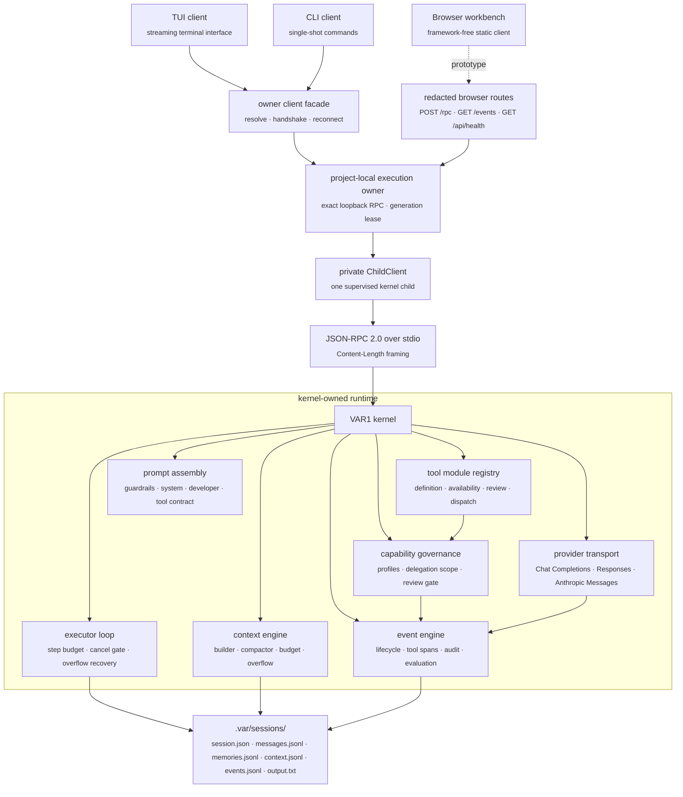
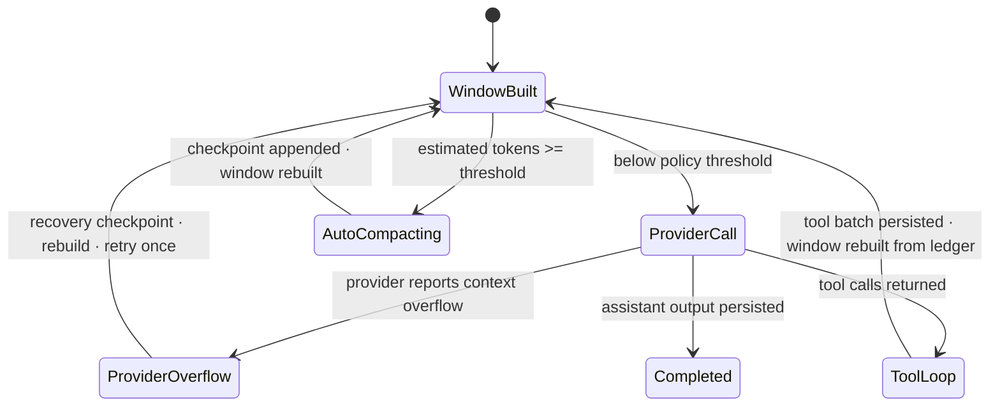
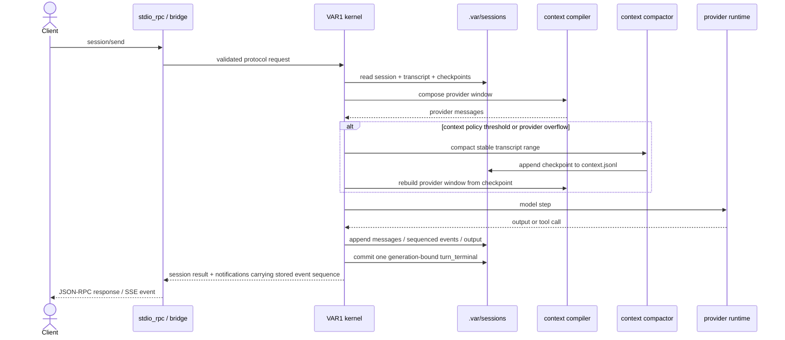
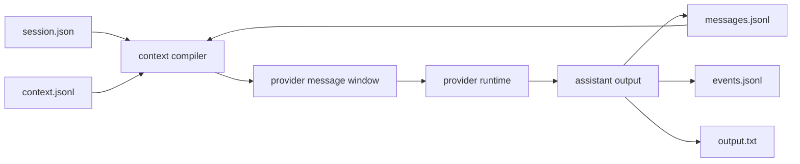

<div align="center">

# VANTARI-ONE

### Local Agent Kernel · Zig Runtime · Optional Tool Dependencies

A native agent runtime built around replayable session state, bounded execution,<br/>
provider-wire adaptation, typed tool governance, and recoverable evidence.<br/>
One binary; one protocol; one owner for runtime truth.

<br/>

[](https://github.com/savageops/VANTARI-ONE/releases/latest)
[](https://github.com/savageops/VANTARI-ONE/releases)
[](#validation)
[](https://ziglang.org/)

[](https://github.com/savageops/VANTARI-ONE/stargazers)
[](https://github.com/savageops/VANTARI-ONE/issues)
[](https://github.com/savageops/VANTARI-ONE/commits/main)

<br/>

[Why VANTARI](#why-vantari) · [Architecture](#architecture) · [Quick Start](#quick-start) · [Tool Catalog](#tool-catalog) · [Protocol](#protocol) · [Session Model](#session-model) · [Security](#security) · [Configuration](#configuration) · [Built For](#built-for) · [Roadmap](#roadmap) · [Validation](#validation)

</div>

---

<br/>

## Why VANTARI

Most agent frameworks treat an LLM session as disposable chat text — messages accumulate in memory, tool calls fire without review, context silently truncates, and nothing survives a process restart. When something goes wrong, there is no ledger, no evidence trail, and no way to replay what happened.

VANTARI treats an agent session as a **durable, replayable state machine**. Every run produces an append-only transcript, structured context checkpoints, typed lifecycle events, and effect receipts for file mutations. The kernel owns execution and recovery; clients observe and control it through one protocol.

**The result:** agent sessions that are dependable, inspectable, resumable, and worth returning to.

That means handling the failure paths as ordinary runtime work: reconstructing fragmented SSE text and tool calls, salvaging the valid prefix of a torn or poisoned JSONL ledger, rebuilding context after overflow without replaying a tool batch twice, reconciling sessions whose process owner disappeared, draining and terminating Windows child processes without losing bounded output, and preserving account identity across different provider wire protocols. These mechanics live in the execution path and its tests rather than in a separate "reliability layer."

<br/>

<table>
<tr>
<td width="50%">

**What you get**
- One compiled binary, zero runtime dependencies
- Sessions that survive restarts, crashes, and context overflow
- Every tool call reviewed before side effects execute
- SHA-256 effect receipts for file mutations
- Append-only audit trail for every session
- Chat Completions, OpenAI Responses, and Anthropic Messages transports

</td>
<td width="50%">

**What you don't need**
- No Python or Node.js runtime after installation
- No container or orchestrator requirement
- No hosted control plane
- No database server or external state store
- No client-owned agent loop
- No implicit trust-all tool execution

</td>
</tr>
</table>

<br/>

## How It Works

The kernel is a state machine. Each step builds a provider-ready context window from the durable transcript, sends it to the model, reviews any tool calls against the compiled capability catalog, executes approved effects, persists everything, and loops.

```text
operator input ─► transcript ledger ─► context compiler ─► provider stream
                                                         ─► assistant deltas / tool calls
                                                         ─► review gate ─► approved effects
                                                         ─► typed events ─► terminal state
```

Every transition produces durable evidence. Tool calls generate `tool_requested` → `tool_reviewed` → `tool_completed` or `tool_blocked` event chains. Command bytes persist as versioned base64 stdout/stderr deltas with stream and cap evidence. File mutations generate `var1.tool_effect.v1` receipts with before/after byte counts and SHA-256 hashes. Context compaction generates structured checkpoints without rewriting the transcript. Nothing is silent.

<br/>

## At a Glance

| Metric | Value |
|---|---|
| **Runtime** | Single static Zig binary — `vantari` |
| **Kernel surface** | 122 backend Zig source files; explicit owners for context, sessions, tools, providers, auth, scheduling, and transport |
| **Proof surface** | 2,129 passing backend cases across source and adversarial pipeline suites |
| **Dependencies** | No language runtime for the core binary; search, eval, LSP, DAP, and other optional tools require their advertised executables |
| **Provider wires** | Chat Completions · OpenAI Responses · Anthropic Messages |
| **Tracked clients** | Native streaming TUI · CLI; the local browser workbench is an ignored prototype in this checkout |
| **Protocol** | Exact JSON-RPC over owner-only loopback HTTP; private Content-Length stdio inside the owner tree |
| **Session storage** | Filesystem JSONL ledgers at `.var/sessions/<id>/` |
| **Platform** | Windows-native first class; Linux/macOS via Zig cross-compilation |

<br/>

## Architecture


```mermaid
flowchart TB
  tui["TUI client<br/><sub>streaming terminal interface</sub>"]
  cli["CLI client<br/><sub>single-shot commands</sub>"]
  browser["Browser workbench<br/><sub>framework-free static client</sub>"]
  tui --> facade["owner client facade<br/><sub>resolve · handshake · reconnect</sub>"]
  cli --> facade
  facade --> owner["project-local execution owner<br/><sub>exact loopback RPC · generation lease</sub>"]
  browser -.->|prototype| bridge["redacted browser routes<br/><sub>POST /rpc · GET /events · GET /api/health</sub>"]
  bridge --> owner
  owner --> child["private ChildClient<br/><sub>one supervised kernel child</sub>"]
  child --> stdio["JSON-RPC 2.0 over stdio<br/><sub>Content-Length framing</sub>"]
  stdio --> kernel["VAR1 kernel"]

  subgraph core["kernel-owned runtime"]
    kernel --> executor["executor loop<br/><sub>step budget · cancel gate · overflow recovery</sub>"]
    kernel --> context["context engine<br/><sub>builder · compactor · budget · overflow</sub>"]
    kernel --> toolruntime["tool module registry<br/><sub>definition · availability · review · dispatch</sub>"]
    kernel --> governance["capability governance<br/><sub>profiles · delegation scope · review gate</sub>"]
    kernel --> prompts["prompt assembly<br/><sub>guardrails · system · developer · tool contract</sub>"]
    kernel --> provider["provider transport<br/><sub>Chat Completions · Responses · Anthropic Messages</sub>"]
    kernel --> events["event engine<br/><sub>lifecycle · tool spans · audit · evaluation</sub>"]
  end

  executor --> store[".var/sessions/<br/><sub>session.json · messages.jsonl · memories.jsonl · context.jsonl · events.jsonl · output.txt</sub>"]
  context --> store
  events --> store
  governance --> events
  toolruntime --> governance
  provider --> events
```

The two tracked client surfaces — TUI and CLI — attach to one project-local
execution owner and enter the same kernel runtime. Closing either client leaves
the owner, fixed pool, scheduler, and active sessions alive. The owner retains
one private `kernel-stdio` child; it does not create a second runtime lane.
Session state, context assembly, provider interaction, tool dispatch, capability
governance, and event emission stay inside the Zig binary. The local browser
workbench exists only as an ignored prototype in this checkout and is not a
shipped client.

### Remote Deployment Boundary

The kernel owns transcript, context, tools, events, and session storage. It supports outbound provider HTTP and a loopback browser bridge, but it does not own public TLS termination, WebSocket fan-out, or remote client identity.

The planned relay remains a client of the kernel over the existing stdio JSON-RPC protocol. Its job is narrow: authenticate remote clients, terminate TLS, and fan out event frames. It must not assemble provider context, infer tool state, or become a second transcript owner.

```text
Local (current):
  CLI/TUI ──owner facade──► execution owner ──private stdio──► kernel ──► .var/sessions/

Remote (planned):
  CLI/TUI ──┐
  Browser ──┼──► relay ──owner protocol──► execution owner ──► kernel ──► .var/sessions/
  Dashboard ┘    (TLS · WebSocket · auth.vantari.one)
```

The promotion test is mechanical: kill the relay, start a fresh relay, and recover every client-visible session from kernel-owned ledgers. Until that path exists and passes, the relay remains roadmap architecture rather than a shipped client.

<br/>

### Layered Kernel Design

```text
┌──────────────────────────────────────────────────────────────────┐
│  CLIENT LAYER              TUI · CLI                              │
├──────────────────────────────────────────────────────────────────┤
│  HOST LAYER                owner lease · loopback RPC · private stdio│
├──────────────────────────────────────────────────────────────────┤
│  EXECUTOR LAYER            loop · step budget · cancel gate     │
├──────────────────────────────────────────────────────────────────┤
│  CONTEXT ENGINE            builder · compactor · budget · overflow│
├──────────────────────────────────────────────────────────────────┤
│  TOOL RUNTIME              registry · review · dispatch · effects│
├──────────────────────────────────────────────────────────────────┤
│  GOVERNANCE                profiles · delegation scope · memory  │
├──────────────────────────────────────────────────────────────────┤
│  PROVIDER TRANSPORT        chat · responses · anthropic · SSE    │
├──────────────────────────────────────────────────────────────────┤
│  SESSION STORE             .var/ filesystem ledgers (JSONL)      │
└──────────────────────────────────────────────────────────────────┘
```

Each layer has a single canonical owner. The context engine never writes to the provider. The tool runtime never writes to the transcript. The provider never reads from the session store. Dependencies flow downward. State flows through explicit function parameters, never globals.

The host layer is the outermost kernel surface: one reconnectable loopback owner
in front of one private framed-stdio kernel child. TUI and CLI are tracked clients. Browser and remote
surfaces remain prototype or roadmap clients. Public networking and remote
identity belong to the planned relay boundary, so local execution does not
inherit deployment infrastructure.

<br/>

## Quick Start

### Build and validate

```powershell
cd apps/backend
.\scripts\zigw.ps1 build test --summary all    # compile + validate
.\scripts\health.ps1                            # verify provider readiness
.\zig-out\bin\vantari.exe run --prompt "Count the lowercase letter r in strawberry."
```

The pinned wrapper isolates both the build graph and direct `zig test`
invocations under `apps/backend/.zig-cache`; tests never inherit the production
`VANTARI_HOME`.

### Install VANTARI

```powershell
cd apps/backend
.\scripts\install_windows.ps1
.\scripts\verify_installed_settings.ps1             # isolated settings/lifecycle smoke
vantari -c                                     # launch the interactive TUI session
```

`vantari` resolves the workspace from the terminal's current directory. Provider credentials live in the installed profile — running from any project directory works without copying auth config.

```powershell
vantari workspace show                          # display active workspace
vantari workspace set <path>                    # pin a specific workspace
vantari workspace clear                         # return to directory-based resolution
```

### Browser workbench boundary

The tracked checkout does not ship a browser client. A local ignored prototype
may use the loopback HTTP bridge, but it has no tracked source, packaging, or
consumer proof and is therefore not part of the release surface.

<br/>

## Buffered tickets and agent pool

Ticket assignment is queue admission, not an immediate child-session launch.
The scheduler claims assigned work only when the configured agent pool has
capacity, then routes the ticket through the existing AgentService and
Supervisor owners. Two source-built kernels now contend through one
crash-released scheduler lock and a persisted generation fence; the native
two-kernel proof produces one winner and one attempt. The same proof now seeds
one assigned ticket and observes one process-serialized claim containing the
worker generation, lease, capability, and deterministic child identity, followed
by exactly one child session. The child then sends the parent one durable
ticket-claim wake through the sequence-addressed agent mailbox. After lease
expiry, terminal evidence settles first. A surviving nonterminal child resumes
under a new worker generation on that same session; only a missing claimed
session returns to `assigned`. Heartbeat advances only while the fixed pool owns
the exact session. The transcript, execution receipt, attempt, and mailbox cursor
do not move. This recovery is source and installed proven; arbitrary external
side-effect certainty still requires the write-intent ledger.

The TUI keeps this mechanic legible without adding a status forest: one non-wrapping footer row shows `status · prompt mode · model · effort · context used/capacity/percent · remaining`; unknown accounting stays `ctx —`, and narrow fitting drops lower-signal detail before codepoint-safe truncation. The footer shows pool and queue pressure only when non-zero, and priced session cost only when terminal telemetry carries a finite value; the activity group shows `Agents completed/total`; `○` marks queued/running activity and `◉` marks complete activity, with explicit failure/cancel markers. Each keyed child row ends with known typed phase and elapsed snapshots when available, followed by a bounded quoted turn summary sourced from the child session summary ledger; an existing `update_session_summary` completion refreshes that quote while the child is still running, and later tool/terminal phases retain it on the same row. Tool lifecycle names remain typed event metadata, not the visible child summary. The composer is a focused surface above a quieter metadata row, and cancellation copy appears only while a run is actively cancelling; the persistent footer omits `Esc cancel`.

When a decision materially changes the work, the root model can call `ask_user` with related multiple-choice questions. The kernel persists one bounded `input_requested` event, and the TUI presents a settings-style panel with one horizontal row per visible question, Enter select, Space check, Up/Down question focus, Left/Right option focus, inline `f / Other`, and an explicit review/submit state. The root normal path and `orchestrate`, `build`, `align`, and `plan` share this controller. Both idle and streaming key paths use one recovery boundary: controller or `input/respond` errors keep the panel active instead of unwinding the TUI. The frame projection rejects invalid UTF-8/control text, uses static display keys while preserving response ids, and guards clipped viewports. Malformed question payloads become one bounded system message plus run cancellation instead of a TUI crash. `input/respond` remains the only resolution path; no question poller, second status bus, transcript copy, or child input loop exists. Headless child profiles do not receive the interactive tool and continue autonomously or report the unavailable capability.

<br/>

## Core Capabilities

### Session-Native Execution

Every agent run is a **session** — a durable execution unit with its own transcript ledger, context checkpoints, event history, and terminal output. Sessions survive process restarts, context overflow, and provider failures. They can be created, resumed, compacted, cancelled, and inspected through the protocol surface.

Each admitted run closes with exactly one `turn_terminal` event. Its
`var1.turn_terminal.v1` payload binds to the durable `session_started` sequence
and records `completed`, `failed`, `timed_out`, or `cancelled`; the session JSON
status is a recoverable projection of that ledger fact.

```text
session/create ─► session/send ─► [executor loop] ─► session/get
                                                    ─► session/compact
                                                    ─► session/send (follow-up)
```

### Context Compaction Engine

The context engine uses a **WAL + checkpoint** model borrowed from database architecture. The transcript (`messages.jsonl`) is the append-only write-ahead log — it is never modified. Context checkpoints (`context.jsonl`) are structured summaries that constrain the model-visible window without rewriting history.


```mermaid
stateDiagram-v2
  [*] --> WindowBuilt
  WindowBuilt --> ProviderCall: below policy threshold
  WindowBuilt --> AutoCompacting: estimated tokens >= threshold
  AutoCompacting --> WindowBuilt: checkpoint appended · window rebuilt
  ProviderCall --> ProviderOverflow: provider reports context overflow
  ProviderOverflow --> WindowBuilt: recovery checkpoint · rebuild · retry once
  ProviderCall --> ToolLoop: tool calls returned
  ToolLoop --> WindowBuilt: tool batch persisted · window rebuilt from ledger
  ProviderCall --> Completed: assistant output persisted
```

Compaction never splits an assistant tool-call batch from its results. If the proposed suffix boundary falls inside a tool-call sequence, the compactor retracts to keep the batch intact. Manual and automatic compaction share the same primitive — the executor triggers it on budget threshold or provider overflow; operators trigger it via `session/compact` with configurable aggressiveness.

### Bounded Branch Context

Child sessions are normal VAR1 sessions with an immutable execution receipt,
not a second transcript system. The receipt names the parent checkpoint; the
context compiler projects that checkpoint's summary plus a bounded recent parent
suffix into the child provider window. The child `messages.jsonl` ledger keeps
only its own branch prompt, and missing or legacy checkpoint identity falls back
to the same bounded suffix rule. Terminal branch output returns through the
existing Supervisor, shard checkpoint ledger, and mailbox path. Shard lifecycle
rows are graph/recovery evidence, not compiler checkpoints; no shard registry,
transcript copier, poller, or extra worker pool exists.

### Scoped Memory

VANTARI keeps memory deliberately smaller than the transcript. `messages.jsonl` remains the complete session record; memory is a compact, source-linked projection of facts, decisions, preferences, invariants, and lessons that are useful later.

```text
~/.vantari/
  memories/memories.md                 global, human-readable, cross-workspace
  sessions/<session-id>/memories.jsonl session-only, typed, append-only
```

The agent can remember something when the operator asks or when a durable decision would otherwise be lost. Uncertain and task-local knowledge defaults to session scope; only genuinely reusable preferences or lessons belong globally. A stable topic key makes repeated writes supersede earlier values, while `forget` appends a tombstone instead of erasing history. Every mutation records its trigger, source session, and transcript sequence.

Recall is rebuilt at cold start and bounded by the `memory` policy in `~/.vantari/config.json`. Session entries are considered first; global entries are either always active or selected by deterministic relevance to the current request. Stored memory never outranks the current operator, applicable instructions, live code, or runtime evidence. Secrets and transcript-shaped payloads are rejected.

Agents use `memory_read` and `memory_write`; humans can simply ask VANTARI to “remember this for this session,” “remember this globally,” or “forget the memory about `<topic>`,” then inspect the corresponding file directly. Autonomous background consolidation and embeddings remain intentionally unsupported until their lifecycle and measurable benefit are proven.

### Tool Governance

Tool calls pass through a **compiled review gate** before side effects execute. The kernel classifies each call from the active `ToolDefinition` catalog's `review_risk` metadata — not from prompting, not from a separate reviewer agent, and not from runtime heuristics.

| Risk class | Behavior | Tools |
|---|---|---|
| `read_only` | Approved through evidence path | `read_file` · `list_files` · `search_files` · `skill_info` · agent query tools |
| `write_capable` | Pre-dispatch review with durable receipt | `write_file` · `append_file` · `replace_in_file` · `send_agent_message` |
| `command_execution` | Pre-dispatch review with bounded output | `shell_exec` |
| `delegating` | Scoped delegation validation | `launch_agent` |
| `unknown_high_impact` | **Blocked before dispatch** | Any undeclared or context-unavailable tool |

Unknown tool names, hallucinated tools, and context-unavailable tools are denied at the binary level with a protocol-visible denial result. The durable event chain is always `tool_requested` → `tool_reviewed` → `tool_completed` or `tool_blocked`.

### Cryptographic Effect Verification

Write-capable file tools return typed **effect receipts** with schema `var1.tool_effect.v1`:

```json
{
  "schema_version": "var1.tool_effect.v1",
  "operation": "write_file",
  "requested_path": "src/main.zig",
  "resolved_path": "/workspace/src/main.zig",
  "before": { "exists": true, "bytes": 1024, "sha256": "a1b2c3..." },
  "after":  { "exists": true, "bytes": 1280, "sha256": "d4e5f6..." }
}
```

The model sees proof of its own side effects before continuing. The harness sees deterministic file-effect evidence without a separate verifier worker. Every file mutation is priced in bytes and hashed — not trusted on faith.

### Streaming TUI

The installed `vantari` client renders a full terminal interface with:

- **Real-time token streaming** — assistant deltas render character-by-character as they arrive
- **One-row tool span updates** — tool execution shows inline progress without scrolling the transcript
- **Bounded command output** — `shell_exec` stdout/stderr streams into the TUI with configurable caps
- **Scrollback** — Page Up/Down, Ctrl+Home/End for full transcript navigation
- **Session continuation** — `vantari -c` resumes the latest session with full transcript hydration
- **Exact event replay** — the TUI renders activity only from contiguous persisted event sequences and canonical child summaries; sequence-less legacy activity is ignored, a gap fetches only the missing suffix, and a completed turn performs one final suffix check
- **Concurrent execution model** — RPC runs on a background thread while the main thread handles UI events and drains live notifications without owning transcript or event truth
- **Command discovery** — type a bare first word such as `s`, `set`, or `settings` to open the bounded palette above the composer; `/` remains compatible, and Up/Down, Tab, Enter, and Escape stay in one input path
- **Settings navigation** — `settings` opens the same-frame overlay; Tab/Right moves forward, Shift+Tab/Left moves backward, and a missing or damaged workspace config falls back to visible compiled defaults

### Scoped Delegation

Child agents are normal bounded sessions. The model chooses eligible actions;
`launch_agent` carries the hard scope fields that the kernel validates before
spawning a child session:

`agents {}` returns one `var1.agent_eligibility.v1` snapshot before launch or
agent-configuration mutation. It hot-loads configured specialists, excludes
unresolvable routes, shows fixed-pool and current-team pressure, advertises
direct/parent/group communication choices, and binds the sorted snapshot to a
SHA-256 receipt. The active prompt can stay solo, inspect, message, challenge,
launch, accept queueing, or request a wake; the kernel does not hardcode that
posture and revalidates every side effect.

| Field | Contract |
|---|---|
| `scope_depth` | Maximum delegation depth; zero-value scope rejected |
| `contact_budget` | Parent supervision limit for the child lifecycle |
| `validation_status` | `unverified` · `self_checked` · `validated` |
| `escalation_reason` | Required for scope expansion beyond default profile |
| `parent_capability_profile` | Inherited runtime boundary for tool classes and budgets |

Two capability profiles — `root` and `subagent` — define typed runtime boundaries over tool classes, delegation policy, budget policy, and provider inheritance. They are not product roles or prompt taxonomy.

### Sequence-Addressed Agent Mailbox

`send_agent_message` lets any eligible session send bounded information to an
exact session in its tree, its immediate parent, or its current sibling group.
`queue` waits for the recipient's next run; `wake` requests the next safe
provider boundary of a live run. Recipient sequence, sender receipt, and unread
cursor are durable `events.jsonl` rows. Provider failure leaves mail unread.
Messages inform; they do not assign tickets, launch work, grant authority, or
copy sender transcripts. Child completion and ticket-claim notices use this same
path.

### Skill Routing

The system prompt carries compact summaries of native skill protocols. The `skill_info` tool returns exact capsules on demand so the model routes into a skill without injecting every skill body into every prompt.

| Skill | Purpose |
|---|---|
| `planning-spec` | Deterministic execution chains, invariant tracking, cold-start handoff |
| `insect` | Compiled Rust web/search/scrape runtime for external research |
| `dupe-audit` | Similarity and duplication audit for regression gates |
| `recon-intel` | Structured repository reconnaissance before architecture changes |
| `ux-playbook` | Enterprise UI/UX structure, hierarchy, and workflow review |
| `t3-tape` | PatchMD workflow for patch stream governance |
| `repo-harvester` | Repository harvest, qualify, archive, and index operations |
| `playwright` | Real browser automation for UI flows and visual verification |
| `task-audit` | Implementation correctness review for drift and violations |

### Provider Wire Adapters

Provider records select a wire contract rather than relying on brand-name heuristics. The executor submits one kernel request shape; the selected adapter owns endpoint construction, message conversion, tool schema, streamed reconstruction, error envelopes, and account headers.

| Wire API | Endpoint | Distinct pressure handled |
|---|---|---|
| `chat_completions` | `/v1/chat/completions` | SSE deltas, sparse parallel tool indexes, compatible cloud/local servers |
| `responses` | `/v1/responses` | Input items, `function_call`, `function_call_output` |
| `anthropic_messages` | `/v1/messages` | Top-level system prompt, content blocks, `input_schema`, required output budget |

Model discovery normalizes the common LM Studio, vLLM, and llama.cpp response shapes. For local endpoints, a discovered model context window may replace the default only when the operator has not configured one explicitly.

### Recovery and Process Supervision

Recovery is derived from persisted evidence. One LF-framed JSONL reader retains the same valid prefix across BOMs, invalid UTF-8, malformed or torn rows, invalid typed schemas, and duplicate or regressing sequence IDs. Append validates the bounded current tail and refuses to write behind poison without truncating evidence. Session reads reconcile stale `running` state when no execution owner remains. Provider overflow writes a checkpoint and rebuilds context from storage before one bounded retry. Command execution owns process spawn, pipe draining, output ceilings, timeout, cancellation, and termination as one state machine.

Presentation lifetime is separate from execution lifetime. TUI and CLI clients
validate `.var/runtime/execution-owner.json` through a live generation handshake;
concurrent starts converge through one workspace lease. Graceful owner shutdown
drains accepted connections before closing the child Job Object. A stale or
crashed owner is rejected and replaced once by the next client. Scheduler
leadership is process-exclusive and generation-fenced in source; mid-turn
owner-crash reconciliation is source-proven through the same ticket session.
The installed forced-kill/restart mesh remains an explicit roadmap gate.

The invariant is cold-start legibility: after an interrupted process, the next client should be able to explain what completed, what did not, and which transition made that conclusion durable.

### Durable Scheduling

Schedules are kernel records, not wrappers around OS cron. The scheduler persists job state, due-time and misfire policy, a nonzero owner generation, execution attempts, and reconciliation evidence. One OS-owned lock spans each tick, so independent kernels cannot both dispatch an expired due row. A host supervisor advances due jobs through the same session primitive used by manual execution; `schedule_job` and the schedule RPCs are control surfaces over that owner.

<br/>

## Tool Catalog

The model-visible catalog is generated from module-owned definitions. Each entry owns its JSON schema, availability declaration, review risk, execution contract, and operator-facing description; the registry probes the selected definition but does not maintain a second name-keyed list. The same definition slice feeds the catalog, provider schema, review gate, and dispatch.

| Tool | Risk | Description |
|---|---|---|
| `read_file` | `read_only` | Bounded text read; workspace-relative by default, explicit external paths in full access mode |
| `list_files` | `read_only` | Native Zig directory and file discovery — no external dependencies; same access boundary |
| `search_files` | `read_only` | Content search via external `ix` binary with structured JSON output; probes availability at startup |
| `write_file` | `write_capable` | Atomic file creation/overwrite with `var1.tool_effect.v1` receipt and SHA-256 verification; same access boundary |
| `append_file` | `write_capable` | Additive writes for ledgers and large artifact chunking with effect receipt; same access boundary |
| `replace_in_file` | `write_capable` | Targeted find-replace with before/after verification and effect receipt; same access boundary |
| `shell_exec` | `command_execution` | Bounded command execution — `argv` · `shell` · `bash` · `powershell` modes with timeout, output caps, streaming, and explicit full-access opt-in |
| `skill_info` | `read_only` | Skill capsule retrieval for protocol routing without prompt pollution |
| `launch_agent` | `delegating` | Scoped child-session creation with capability profile validation |
| `send_agent_message` | `write_capable` | Bounded direct, parent, or current-group information with queue/wake intent and durable delivery receipt |
| `schedule_job` | `write_capable` | Durable scheduler job lifecycle — create, list, get, update, delete, pause, resume, run_now |

**Agent orchestration tools** for parent-supervised child lifecycle:

| Tool | Description |
|---|---|
| `agent_status` | Non-blocking child session snapshot |
| `wait_agent` | Blocking wait with configurable `timeout_ms` |
| `list_agents` | Enumerate parent's active children |
| `send_agent_message` | Queue or wake one exact recipient, parent, or current group without creating work |

All tool definitions are schema-first. The registry resolves availability from module-owned specs — `search_files` probes the `ix` executable at startup and reports unavailable if absent, rather than failing at invocation time. `tools/list` and `vantari tools --json` expose the same catalog with availability metadata, examples, and usage hints.

**Bounded output:** File tools accept full content when the provider delivers it; long generated artifacts still prefer `write_file` seed plus `append_file` chunks for progress and recovery. Shell output capture is capped at 64KB per stream. Output-budget violations return `ToolPayloadExceeded` with repair hints instead of silent truncation.

<br/>

## Protocol

TUI and CLI use exact JSON-RPC through the project-local owner's token-gated
loopback routes. The owner forwards each call to the sole kernel over private
Content-Length-framed stdio. The ignored browser prototype reaches the same
methods through separately redacted bridge routes. A future relay may project
the owner protocol over authenticated WebSockets, but does not exist in the
shipped runtime.

| Method | Operation |
|---|---|
| `initialize` | Server version and capability flags |
| `health/get` | Readiness, provider status, workspace, and auth metadata |
| `session/create` | Initialize a new session record |
| `session/resume` | Load an existing session into runtime state |
| `session/send` | Append user input, compile context, auto-compact if needed, and advance execution |
| `session/compact` | Write a manual context checkpoint from stable message sequence ranges |
| `session/cancel` | Cancel only the run identified by the observed `session_started` sequence; stale generations are no-ops |
| `session/get` | Return session summary, messages, and events |
| `session/list` | Return known session summaries; `limit` bounds lightweight selectors |
| `schedule/get` | Read a durable scheduler job by ID |
| `schedule/list` | List scheduler jobs, optionally including deleted |
| `models/list` | Discover available models from the active or a specified provider |
| `tools/list` | Return the tool catalog in text or JSON format |
| `events/subscribe` | Enable versioned `session/event` notifications carrying the exact persisted event sequence |

<details>
<summary><strong>Session execution sequence</strong></summary>


```mermaid
sequenceDiagram
  actor Client
  participant Host as stdio_rpc / bridge
  participant Kernel as VAR1 kernel
  participant Store as .var/sessions
  participant Builder as context compiler
  participant Compactor as context compactor
  participant Provider as provider runtime

  Client->>Host: session/send
  Host->>Kernel: validated protocol request
  Kernel->>Store: read session + transcript + checkpoints
  Kernel->>Builder: compose provider window
  Builder-->>Kernel: provider messages
  alt context policy threshold or provider overflow
    Kernel->>Compactor: compact stable transcript range
    Compactor->>Store: append checkpoint to context.jsonl
    Kernel->>Builder: rebuild provider window from checkpoint
  end
  Kernel->>Provider: model step
  Provider-->>Kernel: output or tool call
  Kernel->>Store: append messages / sequenced events / output
  Kernel->>Store: commit one generation-bound turn_terminal
  Kernel-->>Host: session result + notifications carrying stored event sequence
  Host-->>Client: JSON-RPC response / SSE event
```

</details>

<details>
<summary><strong>Compaction parameters</strong></summary>

`session/compact` accepts:

| Parameter | Type | Purpose |
|---|---|---|
| `keep_recent_messages` | integer | Messages to preserve in the raw suffix |
| `max_entries_per_checkpoint` | integer | Rows per checkpoint — one entry or a bounded segment |
| `aggressiveness` | float 0..1 | Compression strength; higher values recompact previously covered ranges |
| `trigger` | string | `manual` · `auto_threshold` · `provider_overflow` |

The executor uses the same compactor for automatic pressure relief. It estimates the provider window before each model call, writes `context_compaction_started` / `context_compaction_completed` / `context_compaction_skipped` events, and retries once on provider-reported context overflow.

</details>

<br/>

## Session Model

Every session persists as a self-contained directory of structured JSONL ledgers:

```text
.var/sessions/<session-id>/
├── session.json        lifecycle state · prompt metadata · parent/child references
├── messages.jsonl      append-only transcript — user, assistant, tool-call, tool-result
├── context.jsonl       checkpoint history — compacted summaries with sequence ranges
├── events.jsonl        tool lifecycle · progress · bridge · evaluation events
└── output.txt          latest terminal assistant output
```


```mermaid
flowchart LR
  session["session.json"] --> builder["context compiler"]
  messages["messages.jsonl"] --> builder
  context["context.jsonl"] --> builder
  builder --> window["provider message window"]
  window --> provider["provider runtime"]
  provider --> output["assistant output"]
  output --> messages
  output --> events["events.jsonl"]
  output --> terminal["output.txt"]
```

**Transcript recovery:** The context builder normalizes only known crash-interrupted tool topology when compiling provider context. It synthesizes interruption results for unresolved assistant tool-call tails and skips orphan result rows that cannot be paired with a pending call. The append-only transcript is not rewritten; recovery is a deterministic provider-window projection over durable source evidence.

**Derivative memory:** Entries must cite a source session and sequence range (`source_seq_start` / `source_seq_end`). Transcript replay-shaped payloads are rejected. `messages.jsonl` remains the only full durable transcript.

**Evaluator evidence:** Heartbeat and evaluator-result events carry `executor_mutation: "forbidden"`. Evaluator output is evidence — it never mutates executor state or schedules runtime work through a side channel.

**Bridge audit:** Session, auth, and write-capable bridge RPCs append redacted `var1.bridge_audit.v1` records to `.var/audit/bridge.jsonl`. Audit write failure aborts the action — no unaudited state.

<br/>

## Security

### Bridge Access Control

`vantari serve` binds to `127.0.0.1` by default. The local bridge uses a per-process random token: possession authorizes access for that process lifetime. It is a loopback control boundary, not remote identity. Public authentication belongs to the planned relay and is not claimed by the kernel.

The access layer enforces:

| Control | Mechanism |
|---|---|
| **Origin guard** | CORS restricted to explicit local HTTP origins (`127.0.0.1`, `localhost`, IPv6 loopback); `file://` and `Origin: null` rejected |
| **Token gate** | Per-process `bridge_token` issued via `/api/health`; required as `X-VAR1-Bridge-Token` for `/rpc` and `/events` |
| **Payload redaction** | Sensitive fields and secret-shaped string values redacted from all bridge-visible responses |
| **Audit trail** | `var1.bridge_audit.v1` JSONL records appended before audited RPCs dispatch; write failure blocks the action |
| **Connection admission** | A constant-size gate bounds active HTTP workers; long RPC/event requests do not serialize the listener or permit unbounded spawning |

### Fail-Closed Design

| Boundary | Behavior |
|---|---|
| Unknown tool name | Blocked before dispatch with protocol-visible denial |
| Missing configured prompt file | Error, not silent fallback |
| Empty configured prompt file | Error, not silent fallback |
| Unknown `[context]` config key | Rejected, not ignored |
| Crash-interrupted tool topology | Deterministic provider-window repair; transcript remains append-only |
| Malformed JSONL suffix | Valid prefix retained; append refuses to cross the suffix and leaves bytes unchanged. Operator-facing corruption events are not yet projected. |
| Command output payload exceeds limit | `ToolPayloadExceeded` with repair hints |
| External search binary absent | Tool reported unavailable at startup, not at invocation |
| Bridge audit write failure | Action aborted |
| Delegation scope zero-value | Rejected |
| Profile expansion without reason | Rejected |

<br/>

## Prompt Architecture

The model receives a four-layer prompt envelope assembled at compile time:

```text
┌─────────────────────────────────────────────────┐
│  1. Internal guardrails    compiled, invisible   │
├─────────────────────────────────────────────────┤
│  2. System prompt          .var/prompts/system.md│
├─────────────────────────────────────────────────┤
│  3. Developer prompt       .var/prompts/developer│
├─────────────────────────────────────────────────┤
│  4. Tool-use contract      live tool catalog     │
│     + skill summaries      + protocol rules      │
└─────────────────────────────────────────────────┘
```

System and developer prompts are user-editable workspace files. The internal guardrail layer and tool-use contract are kernel-owned — they enforce workspace boundaries, tool protocol, and streaming discipline regardless of what the user prompt says. Prompt paths in `config.json` must reference existing, non-empty files when explicitly configured.

The TUI adds one session-local behavioral lens on top of this envelope. Shift+Tab
cycles `orchestrate → build → align → plan`; the next `session/send` applies
the selected provider-visible layer and defaults to `orchestrate`. Optional
`agent_routes.prompt_modes` entries can select a provider/model and turn budget
for each lens through the same route owner; explicit per-turn overrides win.
The lens changes guidance and route selection only — not executor logic, tools,
access, or agent capacity — so the model remains the behavior authority.

<br/>

## Configuration

Installed state has two sibling owners under `$VANTARI_HOME` (normally `~/.vantari`):

```text
~/.vantari/
├── config.json    non-secret runtime policy and environment-style overrides
└── auth.json      provider credentials, account identity, active provider
```

Use `vantari config path|show|init|validate` to locate and validate the configuration. Because JSON has no comment syntax, the canonical template carries non-operative `_about` notes and a typed `_help` map beside every configurable value; validation rejects malformed or undocumented metadata while older configs may omit help for newer known values. The runtime never prints or merges `auth.json` into config output.

Use `vantari auth status --json` for a secret-free provider projection, `vantari auth login openai-codex` for local ChatGPT/Codex PKCE login, and `vantari auth logout <provider-id>` to remove one provider record. Login stores OAuth credentials and subscription metadata through the same auth ledger. OAuth `openai-codex` turns now use the dedicated `/codex/responses` transport with account/originator headers; API-key providers remain on their existing OpenAI-compatible route and never fall through to it. Status and health output never includes API keys, access tokens, refresh tokens, or ID tokens.

Provider-scoped API-key login and selection use the same ledger:

```powershell
vantari auth login anthropic --api-key-stdin --model claude-sonnet-4-20250514
vantari auth login openrouter --api-key-env OPENROUTER_API_KEY --model openai/gpt-4o-mini
vantari auth login private-gateway --base-url http://127.0.0.1:43199/v1 --model custom-model --wire-api chat_completions --auth-scheme none
vantari auth use anthropic
vantari providers --json
vantari models --provider anthropic --json
vantari run --provider anthropic --model claude-sonnet-4-20250514 --prompt "..."
```

Anthropic selects Messages (`/v1/messages`) with `x-api-key` and
`anthropic-version`; OpenRouter and custom OpenAI-compatible endpoints select
Chat Completions by default. Custom records may explicitly choose bearer,
API-key, or no-auth headers. Per-turn `run --provider` and
`session/send.provider_id` do not mutate the active provider; `auth use` does.
The provider inventory is metadata-only and never returns credentials.

After login, `.env` is only a bootstrap input. The durable provider record lives in
`$VANTARI_HOME/auth.json` for an installed run or `.var/auth.json` for a workspace
run. A safe status projection looks like:

```json
{"provider_id":"openai-codex","auth_type":"oauth","model":"gpt-5.4-mini","account_id":"acct-...fixture","subscription_plan_label":"ChatGPT Pro","subscription_status":"active","expires_at_ms":2000000000000}
```

Token fields are intentionally absent. The OAuth record routes to `/codex/responses`; it is not an API-key record with a different label.

### TUI controls

The non-secret `tui` section persists the small set of renderer controls that
have live consumers:

```json
{
  "tui": {
    "theme": "vantari",
    "status_bar_position": "bottom"
  }
}
```

Use the `settings` panel to cycle the four named palettes (`vantari`, `midnight`,
`high_contrast`, `amber`) and move the compact status/context row between
`bottom` and `top`. The composer remains at the bottom. Arbitrary color maps and
a menu registry are intentionally not persisted until the renderer needs them.

### Provider

| Parameter | Required | Default | Description |
|---|---|---|---|
| `BASE_URL` | yes | — | Provider base URL |
| `API_KEY` | yes | — | Provider credential |
| `MODEL` | yes | — | Model identifier sent to the provider |
| `WORKSPACE` | no | `.` | Workspace root for `.var/` resolution |

Wire shape defaults to `auto` and resolves from the endpoint; set `provider.wire_api` to `chat_completions`, `responses`, or `anthropic_messages` when an explicit override is required.

### Execution Limits

| Parameter | Default | Description |
|---|---|---|
| `MAX_STEPS` | `4096` | Provider turn ceiling per session |
| `MAX_TOOL_CALLS_PER_TURN` | `16` | Tool-call ceiling per assistant turn |
| `MAX_TOOL_CALLS_PER_SESSION` | `96` | Tool-call ceiling per session |

### Agent filesystem and process access

`runtime.full_access_mode` is `false` by default. Restricted mode keeps agent-facing file, search, LSP, and `shell_exec` paths inside the active workspace. Set it to `true` only when the operator explicitly wants an agent to work in another directory. Resolved child routes inherit the flag for the shared execution context, so every child path tool follows the same boundary; `.var` and session ledgers remain canonical:

```json
"runtime": {
  "full_access_mode": false
}
```

The setting is hot-loaded for the next turn and is available through the TUI Settings surface or the validated `config/set` path. In full access mode, relative paths remain anchored at the active workspace and explicit absolute paths or `..` traversal may target another directory. The canonical VANTARI runtime root, session ledgers, `.var/` state, and configured prompt files remain separate protected owners; full access does not relocate or rewrite them.

### Chat detail and prompt-mode routes

`runtime.log_level` controls only what the TUI projects and how the prompt
frames operator-facing narration: `silent` is the default and suppresses
internal telemetry/repetition, `normal` shows concise checkpoints, and `full`
allows diagnostic lifecycle detail. Durable events, transcript messages, and
recovery records remain complete at every level. The TUI Settings surface
cycles the value with Enter; the validated write applies on the next turn.

Prompt lenses can reuse the same unified provider/auth pipeline without editing
the active provider:

```json
"agent_routes": {
  "prompt_modes": {
    "orchestrate": { "provider_id": "openai-codex", "model": "gpt-5.4-mini" },
    "build": { "provider_id": "anthropic", "model": "claude-sonnet-4-20250514" },
    "align": { "model": "openrouter/anthropic/claude-sonnet" },
    "plan": { "model": "glm-5-turbo", "effort": "low" }
  }
}
```

Only configured fields override the active route. `session/send` fields have
higher precedence, and credentials remain in `auth.json`. Runtime theme and
menu-position settings are intentionally not advertised yet: the renderer
must consume a setting before it becomes a valid capability.

### Context Policy

```json
"context": {
  "auto_compaction": true,
  "manual_compaction": true,
  "context_window_tokens": null,
  "compact_at_ratio_milli": 850,
  "reserve_output_tokens": 8192,
  "keep_recent_messages": 8,
  "max_entries_per_checkpoint": 0,
  "aggressiveness_milli": 350,
  "retry_on_provider_overflow": true
}
```

`context_window_tokens: null` permits local model discovery; a positive value is an explicit operator override. Unknown or mistyped values fail validation.

### Agent behavior and ticket queue

Agent definitions may tune persona, route role, ticket ownership, checkpoint contract, autonomy, effort, and temperature. Omitted or `null` effort/temperature leaves the decision with VANTARI and the resolved route; configuration exposes capability, it does not replace the kernel's orchestration judgment.

Ticket execution has no policy toggle. `assigned` appends queue state only; the
scheduler may claim work only when the fixed-pool projection reports nonzero
`available` capacity. `running` is active work, `idle = max - running`, `queued`
is admitted backlog, and `available = idle - queued` saturated at zero. A changed
`agent_routes.max_concurrency` value replaces the same physical pool at its next
idle boundary; active work drains under the actual prior ceiling. Agent prompts
can decide what work to admit and how to
orchestrate it, but they cannot skip the claim, lease, session, or terminal
evidence boundary. Agents may complete owned tickets but never close them.
Expired ownership preserves the active session and attempt through one `resume`
ticket row. Requeue occurs only when that session does not exist; mailbox
delivery remains sequence/cursor-addressed on the preserved session.

### Prompt Policy

```json
"prompts": {
  "system_prompt_file": null,
  "developer_prompt_file": null
}
```

Prompt paths remain workspace-relative. Missing or empty explicitly configured files fail closed. The `environment` object accepts `VANTARI_WORKSPACE`, `MAX_STEPS`, `MAX_TOOL_CALLS_PER_TURN`, and `MAX_TOOL_CALLS_PER_SESSION`; real process environment values have highest precedence during automatic workspace selection. Once a client explicitly selects an execution-owner workspace, that root is authoritative for config, auth, and runtime state; inherited workspace variables cannot redirect it. This prompt-file boundary is independent of `runtime.full_access_mode`.

<br/>

## Deferred Plugin Boundary

The plugin socket is deliberately not an installed capability. Move40 removed
the default-visible `manage_plugin` placeholder because its enable/disable path
was not wired to discovery or dispatch. The small manifest, isolation, and
socket contracts remain contract-only reference scaffolding; they do not scan
`.var/plugins/`, alter the model-visible catalog, or execute plugin code.

Reopen the boundary only for a concrete user-facing tool need. The future slice
must contribute through the existing tool definition, availability, review,
dispatch, process, and event owners; it must not create a second registry or
executor.

<br/>

## Built For

<table>
<tr>
<td width="33%">

**Solo developers**

Run a local agent that reads your codebase, executes tools with review gates, and produces a durable session you can inspect, resume, or share — without uploading your code to a third-party service.

</td>
<td width="33%">

**Teams shipping agent products**

Embed the kernel behind your own interface. The tracked TUI and CLI demonstrate
the pattern: different interaction surfaces, one protocol, no duplicated
executor. The HTTP bridge is kernel source; a tracked browser consumer is not
currently shipped.

</td>
<td width="33%">

**Researchers and evaluators**

Every tool call, context window, and model interaction is recorded in structured JSONL. Replay sessions, audit decision chains, compare provider behavior, and build evaluation pipelines from real execution traces.

</td>
</tr>
</table>

<br/>

## Roadmap

| Milestone | Status |
|---|---|
| Session-native execution with durable JSONL ledgers | **Shipped** |
| Context compaction engine — WAL + checkpoint model | **Shipped** |
| Compiled tool governance with review gate and effect receipts | **Shipped** |
| Streaming TUI with concurrent execution model | **Shipped** |
| Scoped delegation with typed capability profiles | **Shipped** |
| HTTP bridge with origin guard, token gate, and audit trail | **Shipped** |
| Native skill routing with on-demand capsule retrieval | **Shipped** |
| Wire-protocol routing — Chat Completions, Responses, Anthropic Messages | **Shipped** |
| Provider model discovery and local context-window detection | **Shipped** |
| Durable scheduler records and attempts | **Source proven; two-kernel leadership gate passed** |
| Buffered ticket admission, fixed capacity, and same-session owner recovery | **Source and installed Windows process meshes passed** |
| Sequence-addressed direct/group/parent agent mailbox | **Source and installed Windows restart/delivery meshes passed** |
| Model-selected route eligibility and team snapshot | **Source proven; dedicated installed snapshot proof not run** |
| Plugin runtime with typed socket execution | **In progress** |
| Provider fallback chains | Planned |
| Local Codex subscription auth — CLI PKCE login, durable ledger, logout, secret-free status, and explicit `/codex/responses` transport | Source + installed local fixture proven; real entitlement proof pending |
| Identity auth against `auth.vantari.one` — PKCE OAuth mirroring the openai-codex pattern | Planned |
| Remote relay — authenticated WebSocket fan-out with no session ownership | Planned |
| Multi-client session binding — connected clients as capability peers, not parallel authority. Client-offered tools must route through the existing module-owned catalog, not a parallel tool system | Planned |
| Cloud dashboard as event-spine read model — same socket, read-only | Planned |
| Frontend workbench — salvaged component library, deferred until socket contract is stable | Deferred |

<br/>

## Design Decisions

<details>
<summary><strong>Why Zig</strong></summary>

Zig gives the kernel properties that matter for an agent runtime:

- **Single native executable** — no interpreter or language runtime after installation. Build-time packages compile into `vantari.exe`.
- **Deterministic memory management** — no GC pauses during SSE streaming or tool dispatch. Every allocation has an explicit owner and a known lifetime.
- **Compile-time verification** — the tool registry, risk classification, and capability profiles are verified at build time. Invalid configurations are compile errors, not runtime surprises.
- **Cross-platform process supervision** — `shell_exec` handles argv, shell, bash, and PowerShell modes with native process spawning, timeout enforcement, and bounded output capture on Windows and POSIX.
- **AtomicFile writes** — session metadata commits through Zig's atomic file primitive, preventing truncate-before-write corruption windows in the session store.

The result is a native runtime with explicit allocation, process, and protocol ownership. The executable is the deployment unit; the filesystem ledgers are the durable state.

</details>

<details>
<summary><strong>Why append-only JSONL</strong></summary>

The session store uses the same durability model as database write-ahead logs:

- `messages.jsonl` is the **immutable transcript** — it is never edited, only appended. One shared reader stops at the first invalid row, and the writer refuses to append behind a poisoned tail without rewriting history.
- `context.jsonl` is the **checkpoint file** — structured summaries with sequence range coverage, used by the context builder to create model-visible windows without mutating the transcript.
- `events.jsonl` is the **audit trail** — every state transition, tool lifecycle event, and bridge action has a writer-assigned monotonic sequence. Live `session/event` notifications are emitted only after persistence and carry that exact sequence.

This separation keeps recovery mechanical. Context compaction changes the model-visible projection, never transcript truth. Each session directory can be copied, inspected with ordinary text tools, or retained as execution evidence without a database export.

</details>

<details>
<summary><strong>Why provider wires are explicit</strong></summary>

Provider branding is not a wire contract. VANTARI selects one of three typed adapters:

- **Chat Completions** — `/v1/chat/completions`, including compatible cloud and local servers
- **OpenAI Responses** — `/v1/responses` with input items and function-call output
- **Anthropic Messages** — `/v1/messages` with content blocks and `input_schema` tools

The socket owns request/response semantics; provider records select base URL, model, credential, account context, and wire API. Unsupported wire behavior fails at the adapter boundary rather than being guessed from a provider name.

</details>

<details>
<summary><strong>Why multiple clients, one protocol</strong></summary>

The tracked TUI and CLI speak to the same kernel protocol. The HTTP bridge
exposes the same kernel boundary, but this checkout does not ship a tracked
browser consumer. This means:

- **No execution path divergence** — clients submit `session/send`; the kernel advances the session.
- **No state duplication** — clients render session state but do not own it. A session started in one surface remains recoverable through another.
- **No client-owned executor** — future tracked clients must submit through the
  same protocol instead of creating a second runtime.

Runtime truth lives in `.var/sessions/`. Future clients, including a relay or dashboard, must remain observation and control surfaces over that owner.

</details>

<details>
<summary><strong>Why remote transport stays outside the kernel</strong></summary>

The kernel already performs outbound provider HTTP and can expose a loopback HTTP bridge. What it does not own is public deployment transport: TLS termination, WebSocket fan-out, remote identity, tenancy, or edge policy.

A future relay can supervise the kernel as a subprocess, subscribe to the event spine, and mirror frames to authenticated clients. The relay remains replaceable because it owns no transcript, provider context, or tool state.

The boundary is simple: remote capability may add a process, but it may not add a second runtime authority.

</details>

<br/>

## CLI Reference

```text
vantari run    --prompt <text>                  single-shot execution
               --prompt-file <path>             prompt from file
               --session-id <id>                resume existing session
               --json                           JSON output

vantari serve  --host <addr>  --port <n>        start HTTP bridge

vantari health --json                           provider readiness

vantari tools  --json                           tool catalog with availability

vantari schedule list [--json] [--include-deleted]   list scheduler jobs
vantari schedule get <job-id> [--json]               inspect a scheduler job

vantari providers [--json]                          list configured providers/models
vantari models [--json] [--provider <id>]            discover available models

vantari config path|show|init|validate                manage non-secret runtime policy

vantari                                        launch streaming TUI
vantari -c                                     continue latest session
vantari workspace show|set <path>|clear        workspace management
vantari sessions --limit <n> --json            list sessions
vantari auth status|login|use|logout <provider> identity and provider auth
```

<br/>

## Read Next

| Document | Purpose |
|---|---|
| [`AGENTS.md`](./AGENTS.md) | Kernel governance contract — ownership rules, anti-patterns, proof-gated lifecycle |
| [`.docs/index.md`](./.docs/index.md) | Project records, research, planning chains, and completed-work evidence |
| [`.docs/technical_summary.md`](./.docs/technical_summary.md) | Current runtime, ticket/pool, TUI projection, and proof boundary |
| [`.refs/index.md`](./.refs/index.md) | Local reference corpus and harvest rules |
| [`apps/backend/README.md`](./apps/backend/README.md) | Kernel internals, module ownership, layered architecture |
| [`apps/backend/architecture.md`](./apps/backend/architecture.md) | Canonical architecture map with sequence diagrams and state machines |
| [`.docs/research/2026-08-12-full-harness-sitrep.md`](./.docs/research/2026-08-12-full-harness-sitrep.md) | Current full-harness design, pipeline, proof, concerns, and closure order |
| [`.docs/research/2026-08-13-sequence-addressed-agent-mailbox.md`](./.docs/research/2026-08-13-sequence-addressed-agent-mailbox.md) | Agent-mailbox competitive harvest, event grammar, context boundary, and residual risk |
| [`.docs/research/2026-08-13-tui-composer-move42.md`](./.docs/research/2026-08-13-tui-composer-move42.md) | Seven-source TUI harvest, composer surface hierarchy, conditional cancellation, and narrow/wide proof |
| [`.docs/research/2026-08-13-prompt-mode-move43.md`](./.docs/research/2026-08-13-prompt-mode-move43.md) | Seven-source prompt-mode harvest, Shift+Tab cycle, provider-visible layer, and rejected executor/registry complexity |
| [`.docs/research/2026-08-13-status-row-move44.md`](./.docs/research/2026-08-13-status-row-move44.md) | Eight-source status-row harvest, compact footer order, truthful context display, and rejected gauge/registry complexity |
| [`.docs/research/2026-08-13-agent-queue-cost-move45.md`](./.docs/research/2026-08-13-agent-queue-cost-move45.md) | Seven-source agent/queue/cost harvest, signal-gated footer policy, priced-session boundary, and rejected poller/registry complexity |
| [`.docs/research/2026-08-13-model-selected-agent-eligibility.md`](./.docs/research/2026-08-13-model-selected-agent-eligibility.md) | Eight-reference selection harvest, deterministic eligibility receipt, prompt-profile tracer, and rejected selector architecture |
| [`.docs/todo/findings/00-INDEX.md`](./.docs/todo/findings/00-INDEX.md) | Priority-ordered executable readiness findings |

<br/>

## Validation

The pinned Debug and ReleaseFast graphs currently pass 2,129 test cases across `apps/backend/src/`
and `apps/backend/tests/`. They target state transitions, protocol edges, and
failure pressure rather than line coverage:

- Corrupted JSONL suffixes, torn writes, BOMs, duplicated sequence IDs
- Stale running sessions with no active kernel owner
- Crash-interrupted tool batches and deterministic provider-window repair
- Context overflow recovery without duplicate transcript entries
- Command timeout, process locks, stdout/stderr cap markers
- 100-way same-session admission with one turn owner and retained steer messages
- Active-request shutdown with cancellation before join and one terminal event
- Bridge token verification, origin guard, payload redaction
- Delegation scope zero-value rejection and profile expansion validation
- Direct/group/parent agent mail, replay, provider-failure unread retention,
  safe-boundary wake, ticket claim, and child-completion convergence without
  transcript replication
- Deterministic route eligibility, unavailable-route filtering, depth and
  capacity pressure, and quiet-versus-hive prompt behavior through one executor
- Session-local prompt-mode cycle, provider-visible selected layer, and
  fail-closed unknown `session/send.prompt_mode`
- Compact non-wrapping TUI status row: status mapping, prompt mode, model,
  effort, context remaining/unknown state, and codepoint-safe truncation
- Signal-gated footer pressure and priced session cost: active/max agents,
  queue, and finite `turn_terminal.cost_total_usd`; unknown pricing stays quiet
- Agent group/child `○`/`◉` markers and one-row `agent - state "latest summary"`
  projection; typed phase and elapsed evidence stays out of the visible row,
  while the existing summary-tool boundary refreshes the quoted detail
- Registry-backed command autocomplete above the composer: bare first-token
  prefixes such as `set` discover `settings`, `/` remains compatible, and
  arrows, Escape, Tab, and Enter operate the bounded transient palette
- Optional orchestrate-only footer sweep from the isolated campaign controller;
  other prompt modes stay static and the loop remains event-driven outside the
  bounded active animation window

```powershell
cd apps/backend
.\scripts\zigw.ps1 build test --summary all
```

The count is test inventory, not a substitute for a green checkout. Release proof requires the complete build graph above, a freshly installed Windows binary, provider health, and an end-to-end session through the installed executable. A passing assertion is useful only when it proves an invariant a shallow implementation would violate.
