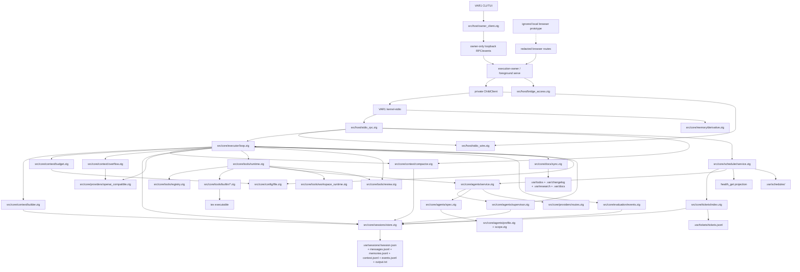
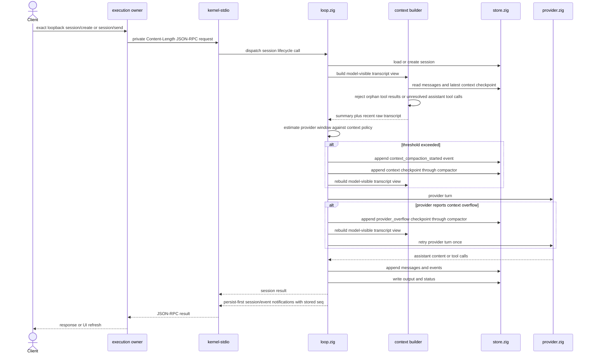
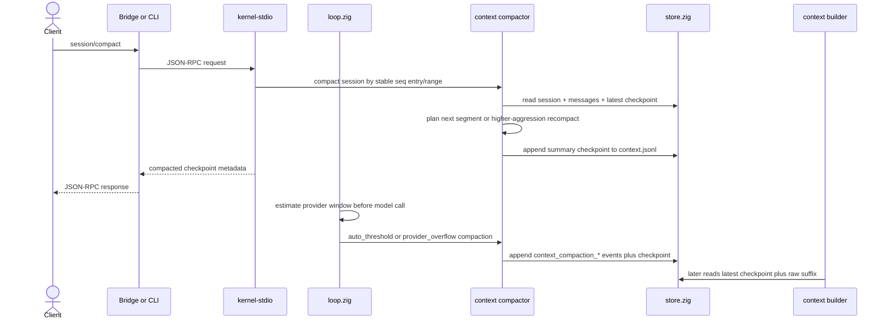
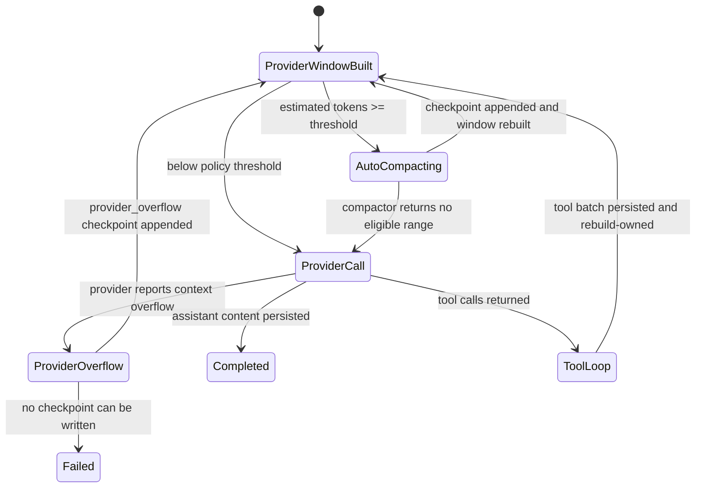
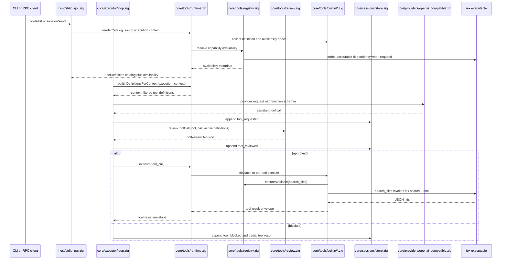
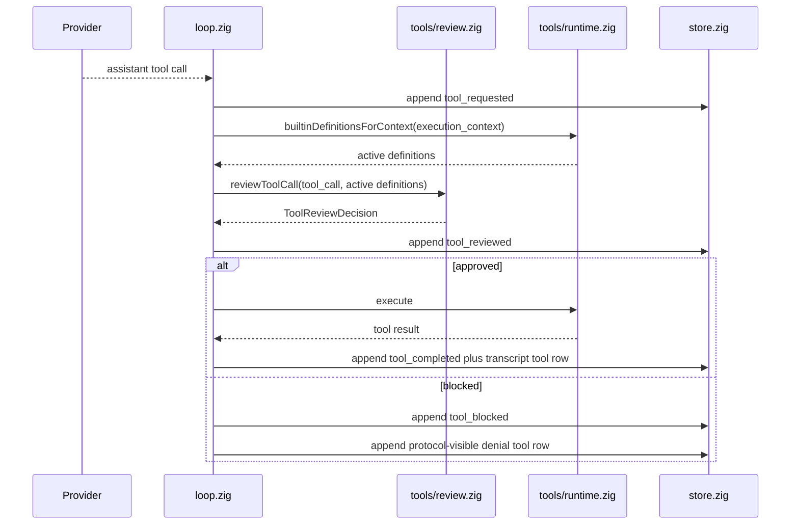
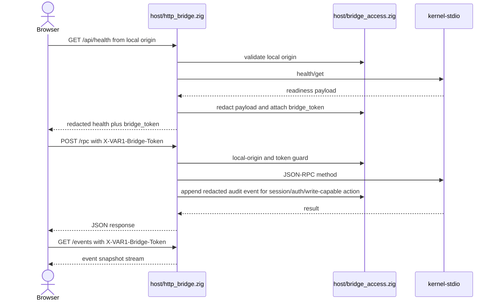
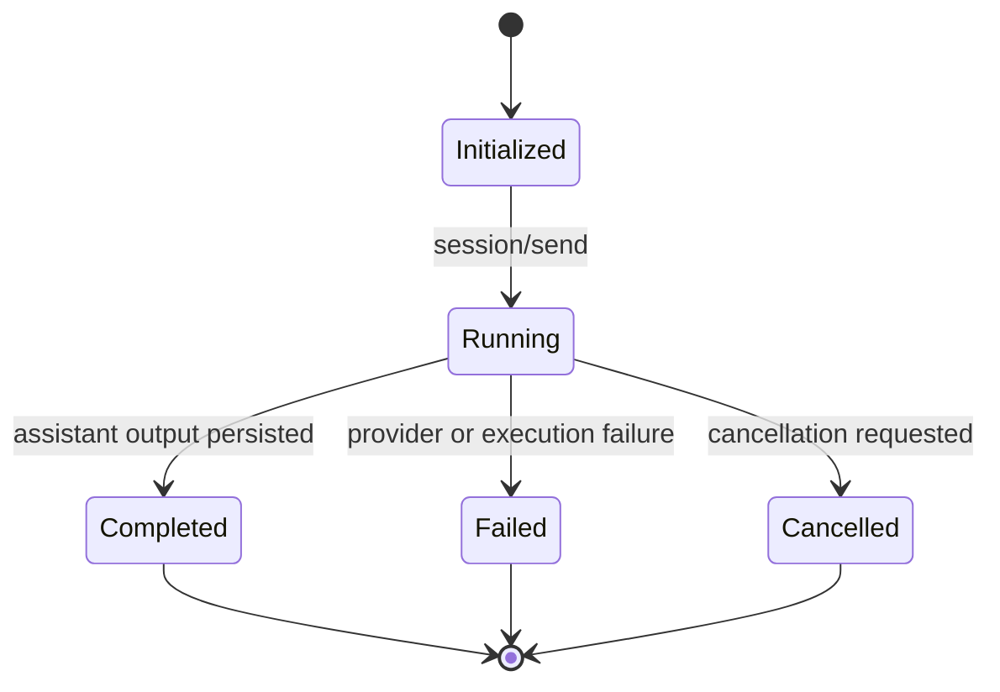

# VAR1 Architecture

This is the canonical architecture map for the current `VAR1` agent-session runtime.

## Architecture lock

- one execution primitive: session
- one durable source of truth: `.var/sessions/<id>/`
- one presentation transport: exact JSON-RPC through owner-only loopback HTTP
- one private child protocol: JSON-RPC 2.0 over stdio with Content-Length framing
- one project-local execution owner: one lease, one projection, one kernel child
- one local bridge surface for browser clients: `/rpc`, `/events`, `/api/health` with token-gated RPC/event access
- one executable name: `VAR1`
- two hidden process modes: `execution-owner` and `kernel-stdio`; foreground
  `serve` acquires the same owner lease
- browser bridge protocol is kernel source; apps/frontend is an ignored local
  prototype and is not a tracked client owner

## Current readiness boundary

This document describes both current owners and target invariants. The
[2026-08-12 full-harness SITREP](../../.docs/research/2026-08-12-full-harness-sitrep.md)
is the current promotion boundary. Source-built TUI and CLI clients now attach
to one persistent workspace owner, so the fixed pool survives presentation
exit. Scheduler leadership is now inter-process exclusive and generation-fenced
in source. Owner-process crash still loses in-memory worker state, and
exactly-once resume/requeue is not yet shipped.
Exact stored event sequence transport, shipped-TUI replay, generation-bound
interactive cancellation, host request ownership, same-session admission,
buffer projection, shutdown cancellation, test-root isolation, append-only
summary revisions, and per-session message sequencing are closed. Treat the
remaining findings as authoritative over older shipped claims.

## Runtime slice



## Host request lifecycle

```text
client -> owner projection -> live generation handshake -> exact loopback RPC
  -> private Content-Length frame -> 32-request admission -> four-worker pool
  -> Runtime.tryStartSession (one owner or bounded steer)
  -> provider/tool loop -> durable terminal event -> response

client EOF/deinit -> owner and kernel remain alive

owner shutdown -> drain accepted loopback connections -> close child stdin
  -> stop admission -> Runtime.beginShutdown
  -> fence late starts + signal active turns -> join request pool
  -> stop scheduler/buffer services -> free projections/runtime
```

Automatic discovery may consume `VANTARI_WORKSPACE`; an already explicit owner
selection may not. `config.loadDefaultForExplicitWorkspace` pins config, auth,
ledgers, and the owner projection to the selected root before child creation.
`run --session-id` submits through this owner. No per-session worker executable
or second direct executor path exists.

`BufferProjection` binds session identity and preview under one mutex. Callbacks
carry their originating session ID; late prior-session previews are discarded,
and executor consumers receive owned exact-session copies.

## Ticket and buffered agent execution

Ticket assignment is a durable queue transition, not a child-session launch. `core/tickets/index.zig` owns ticket records, queue projection, claim/lease state, heartbeat evidence, stale-owner repair, and terminal transitions. `core/scheduler/service.zig` claims assigned work only when the configured pool has capacity, then routes the ticket through the existing `core/agents/service.zig` and `core/agents/supervisor.zig` owners.

`core/scheduler/store.zig` acquires the shared
`shared/process_lock.zig` primitive before reading leadership state and holds it
through the full tick. `lease.json` is the durable projection, not the mutex: it
carries the exact random nonzero worker generation and is read back before any
dispatch. An expired projection permits failover only after the prior OS lock is
released. Two independently started kernels therefore yield one active leader.

```text
log_ticket transition(assigned)
  -> ticket queue projection
  -> scheduler claim + lease
  -> AgentService route/receipt
  -> Supervisor fixed-pool slot
  -> child session events and summary
  -> terminal evidence + ticket reconciliation
```

There is no second worker registry or ticket execution policy. Assignment is
always a ledger-only admission; `agent_routes.max_concurrency` is the sole
configured capacity ceiling. Health and client projections expose pool/queue
pressure without taking ownership of scheduling.

## Session message flow



## Context compaction flow



Manual and automatic compaction share the same primitive. The manual RPC path is gated by `context.manual_compaction`; the executor path is gated by `context.auto_compaction`, `context.context_window_tokens`, `context.compact_at_ratio`, and `context.reserve_output_tokens`. Provider overflow recovery is separately gated by `context.retry_on_provider_overflow` and retries one provider call after a real checkpoint is written. Checkpoint planning does not split assistant tool-call batches; if the proposed raw suffix would start at a tool-result row, the compacted segment is moved back so the assistant tool-call message and its tool results remain together in model-visible history.

The context builder also validates OpenAI-compatible tool-call adjacency before any provider dispatch. An assistant message with tool calls must be followed by matching tool-result rows in assistant source order; orphan tool rows and unresolved assistant tool-call tails fail closed as transcript integrity errors. This keeps `.var/sessions/<id>/messages.jsonl` append-only while preventing corrupt or crash-interrupted ledgers from becoming malformed model-visible context.

The executor keeps a preserved in-memory suffix only for non-durable internal continuations. After a complete assistant tool-call batch and its tool-result rows are appended to `messages.jsonl`, ownership transfers back to the context builder. Provider-overflow recovery and threshold compaction therefore rebuild durable tool context from the session ledger instead of replaying both the ledger copy and an executor-local copy into the same provider retry payload.



## Tool initialization flow



Tool definitions are schema-first. The shared shape lives in `shared/types.zig` as `ToolDefinition { name, description, parameters_json, review_risk, example_json, usage_hint }`. Per-tool modules under `core/tools/builtin/` own their definition, review risk, availability contract, and execute path. The registry resolves availability from module-owned names/specs instead of duplicating string branches. Provider request construction, CLI catalog export, RPC catalog export, review classification, prompt guidance, and failure repair hints derive from those module-owned metadata surfaces. Backend primitives are not agent tools until this metadata-and-dispatch path exists.

`search_files` is the content-search tool. It declares an `external_command("iex")` dependency, resolves the workspace path in Zig, then invokes `iex search --json --max-hits ...` through the command-runner boundary. The advertised pattern contract is native IX/IEX expression syntax (`lit:needle`, `re:TODO|FIXME`, `lit:a || lit:b`), not rg/grep flag emulation. `list_files` is the native Zig path-discovery tool and does not shell to `iex`. Installing `VAR1` therefore requires a real `iex` executable for content search; when it is absent, catalog availability reports `search_files` as unavailable and execution fails early with `ToolUnavailable`.

## Capability governance flow



The review gate is a kernel state transition, not a copied reviewer-agent architecture. Read-only tools receive review evidence and continue through the existing dispatch. Write-capable, workspace-state, and delegation tools are classified from active `ToolDefinition.review_risk` metadata before execution. Tool names absent from the active catalog, including context-unavailable tools, are denied before dispatch and returned to the provider as `ToolReviewBlocked`, preserving the OpenAI-compatible tool-call protocol.

Delegation is validated at one eligibility-first agent boundary. In root orchestrator mode, `agents {}` must precede launch or configuration mutation, but it is not a mandatory first-turn action. `AgentService` hot-loads the registry, resolves every route, reads fixed-pool and current-team projections, and returns one sorted `var1.agent_eligibility.v1` snapshot with a SHA-256 receipt. The active prompt chooses whether to stay quiet, inspect, message, challenge, launch, accept queueing, or wake; no executor branch selects for it. `launch_agent` accepts one `{ context, tasks[] }` batch whose task ids must be route-eligible and revalidates scope, route, depth, contact, and capacity before effects. `core/agents/spec.zig` resolves editable personas over compiled execution-kind and capability-profile floors; custom ids must inherit through `extends`, so config cannot grant arbitrary tools or provider credentials. `configure_agent` validates and atomically replaces `config.json`; the next eligibility or launch read sees the new registry. Child prompts contain only the selected private capsule, explicit shared context, finite task, and output contract. The parent transcript is never copied into a child window.

Derivative memory and evaluator evidence are deliberately non-authoritative. `src/core/memory/derivative.zig` requires `session_id`, `source_seq_start`, and `source_seq_end`, and rejects transcript replay-shaped payloads. `src/core/evaluation/events.zig` appends redacted heartbeat/evaluator events with evaluator mutation forbidden. RecursiveMAS latent transfer, GRASP gradients, dynamic markets, autonomous background evolution, exact tokenizer integration, and plugin auto-discovery remain unsupported behavior until there is a tested contract for cancellation, idempotency, cold-start recovery, and lifecycle ownership.

## Bridge access flow



The bridge binds to `127.0.0.1` by default. CORS allows only explicit local HTTP origins; direct-file `Origin: null` callers are rejected so bridge access remains bound to a local browser origin. `/rpc` and `/events` require the health-issued bridge token; `/api/health` is the handshake route. `host/bridge_access.zig` owns access policy, sensitive-field and secret-shaped value redaction for health/error/RPC/event payloads, audit classification, and append-only `var1.bridge_audit.v1` emission to `.var/audit/bridge.jsonl`; `host/http_bridge.zig` owns the route transport. Audit persistence happens before audited session/auth/write-capable RPC dispatch, so an audit write failure blocks the action instead of creating unaudited state.

## Session state machine



## Durable contract

Every session directory contains:

- `session.json`
- `messages.jsonl`
- `memories.jsonl`
- `context.jsonl`
- `events.jsonl`
- `output.txt`

`messages.jsonl` is the complete append-only transcript. One execution-owner-local per-session ledger state serializes user, assistant, assistant-tool-call, tool-result, and idempotent convergence appends. It initializes sequence from the last valid bounded tail row instead of reparsing transcript history; append failure invalidates the cached cursor before retry. `memories.jsonl` is the session-only append ledger for compact source-linked facts, decisions, preferences, invariants, and lessons; repeated topics supersede earlier values and forget operations append tombstones. `context.jsonl` is compact checkpoint history written by the context compactor and used by the context builder to create model-visible history without rewriting transcript history. Each checkpoint marks the covered source sequence range, the next raw `first_kept_seq`, `compacted_entry_count`, and `aggressiveness_milli`, so compaction can advance one JSONL entry at a time or recompact an existing range when a stronger slider value is requested. `events.jsonl` assigns the sole durable render identity. Live notifications carry that stored sequence after append; the tracked TUI requests `session/get { after_seq, events_only }` only when it detects a gap and once after turn completion. `shared/jsonl.zig:PrefixReader` is the one LF-framed read boundary for events, messages, context, intents, and summaries. It accepts a leading BOM, rejects invalid UTF-8/JSON/typed schema and non-increasing sequence rows, and ends every projection at the same valid prefix. `fsutil.appendJsonlRecord` validates the bounded current tail through that owner and refuses poison without truncating or appending behind it.

`$VANTARI_HOME/config.json` is the canonical non-secret policy file. Its typed sections own runtime limits, wire API selection, role routing, editable agent definitions, context policy, prompt paths, and supported environment-style overrides. Built-in agent rows may tune persona/condition/route/budgets or be disabled; custom ids must inherit a compiled capability floor. `$VANTARI_HOME/auth.json` is the sibling credential/provider ledger. API keys, OAuth tokens, account identity, and active-provider state never move into config output. Nested/AppData auth paths are one-time migration inputs; `settings.toml` is no longer a runtime reader. The Windows installer preserves valid config byte-for-byte and backs up plus materializes the current schema only when the retained file fails validation.

### Agent access boundary

`runtime.full_access_mode` is owned by `core/config/file.zig`, defaults to `false`, and propagates through `types.Config`, resolved routes, draft/buffer configs, and `ExecutionContext`. The shared `fsutil.resolveWithAccessMode` primitive is the only path decision: restricted mode enforces workspace containment; explicit full access keeps relative paths workspace-rooted and permits absolute or traversing paths for file, search, LSP, and process tools. `.var` runtime state, session ledgers, and configured prompt files retain their canonical workspace/runtime owners. No tool may bypass the switch with a second resolver.

`src/core/prompts/` owns the model-presented prompt envelope. When no project prompt override is configured, it uses compiled system/developer layers. When an override path is configured, the file must exist and contain non-whitespace content; missing or empty configured prompt layers fail closed. The builder then injects the hidden runtime guardrail layer and appends the live catalog plus a runtime-owned burst/checkpoint contract. Long work interleaves one bounded observable step, one tool/delegation action batch, evidence inspection, and one compact checkpoint naming changed state, proof, blocker or residual risk, and next action. The assistant checkpoint is persisted in `messages.jsonl`, included by later context rebuilds, and never requests private chain-of-thought. A checkpoint does not terminate the run; the loop continues until terminal proof or a named blocker. Provider transport remains OpenAI-compatible by sending the resulting envelope as a system-role message while preserving internal/system/developer/tool boundaries inside the prompt text.

`store.ensureStoreReady(...)` creates the canonical sessions directory and initializes execution-owner-local sequence state. It never scans or rewrites existing `session.json` records. Explicit migrations own schema changes; this prevents startup cost from scaling with session count and prevents mixed-version processes from erasing additive fields they do not understand.

## Role-routed agent execution

`core/agents/spec.zig` owns stable specialist identity and hot-loads `config.json.agents.definitions`. An `AgentSpec` fixes execution kind, capability profile, route role, execution ceilings, recursion policy, and output contract. Built-in rows may be tuned or disabled; a custom id must extend one built-in floor. Operator configuration may remap provider, model, wire API, thinking mode, and context/output budgets through `core/providers/routes.zig`; it cannot weaken the inherited execution kind or capability profile.

`core/agents/service.zig` validates one `{ context, tasks[] }` batch, resolves routes, persists secret-free execution receipts, then admits the group to `core/agents/supervisor.zig`. The supervisor owns one fixed `std.Thread.Pool`, O(1) group/parent indexes, a completion condition, cancellation, terminal-event ordering, and idempotent mailbox-backed convergence. Healthy wait/status paths do not scan `.var/sessions`; ledger traversal is an explicit cold-start recovery path.

The project-local execution owner keeps this sole service/pool/scheduler
composition alive across TUI and CLI detach. It does not make in-memory child
work crash-resumable: owner death still requires the generation-fenced
reconciliation assigned to moves 27–30. Move 23 closes scheduler leadership.
Move 24 closes ticket admission split-brain: `core/tickets` holds one shared
process lock across projection, validation, and append; the winning claim row
commits worker generation, lease, attempt, capability hash, and a deterministic
child-session id before `AgentService` can create or submit that session.
Move 25 proves every assignment path is ledger-only and deletes the unused
ticket execution-policy surface.
Move 27 replaces definition-only discovery and always-on fan-out prose with one
route-resolved eligibility/team snapshot. A deterministic receipt binds current
capacity, team, communication, depth, contact, eligible, and unavailable state;
quiet and hive prompts select different actions through the same executor.

`core/executor/loop.zig` parks a waiting parent on the supervisor condition without a provider call. The first unconsumed terminal child sends its bounded canonical summary through the parent mailbox, which wakes the parent, rebuilds through the context compiler, and permits the next routing/synthesis turn while unfinished siblings remain supervised. A parent cannot emit terminal output while any owned child remains active. Full specialists execute as ordinary isolated VAR1 child sessions. Tool-free `model_task` specialists use one provider turn and validate their supplied output schema without acquiring a second transcript or tool runtime.

Child assistant/reasoning deltas and tool transcripts stay in the child ledger. The parent event spine receives bounded lifecycle events plus mailbox delivery; it never receives a copied child transcript. Every child `session.json` keeps a heap-owned immutable execution receipt containing the secret-free resolved agent, route, model, wire API, budgets, group, and branch identity; explicit checked JSON decoding preserves that receipt across optimized status rewrites and cold recovery. CLI, stdio, and TUI consume the same projection. The TUI renders Search, Explore, Agents, and To-dos through one group/item grammar with `[ ]`, `[>]`, `[x]`, `[!]`, `[-]` markers and `|--` / `` `--`` child rails; tool lifecycle phases remain event metadata while the child row is replaced by the bounded `assistant_response` summary from `sessions/summaries.jsonl`. No second status bus exists.

### Sequence-addressed agent mailbox

Move 26 adds one sequence-addressed mailbox through the existing
agent/session/event lane. Every agent remains a
normal session, including a child that becomes a bounded parent. The delivery
surface resolves direct-session, parent, and current-group targets; carries a
bounded body plus summary or artifact references; and persists delivery sequence,
unread cursor, acknowledgement, and explicit queue/wake intent.

The mailbox is source-shipped. Child completion and ticket claim use it instead
of convergence-specific transcript messages or a bespoke claim event. Context
compilation injects only the recipient's bounded unread batch and acknowledges it
after provider success; it never copies sibling transcripts or creates a generic
topic/subscription broker. Tickets remain the only work lifecycle. Move 29 owns
exact owner-generation delivery reconciliation across process death.

## Module ownership

- `src/shared/types.zig`
  shared runtime types and session contracts
- `src/shared/fsutil.zig`
  bounded filesystem helpers for text reads, parent-directory creation, and cross-platform path normalization
- `src/core/sessions/store.zig`
  canonical session storage
- `src/core/executor/loop.zig`
  kernel-owned execution loop
- `src/core/context/builder.zig`
  sole owner for turning session storage into provider-ready transcript messages
- `src/core/context/compactor.zig`
  sole owner for planning and writing summary checkpoints from stable message sequence entries/ranges
- `src/core/context/budget.zig`
  approximate provider-window token estimator and compaction-threshold calculator
- `src/core/context/overflow.zig`
  provider-error classifier for explicit context-window overflow, excluding rate-limit and availability failures
- `src/core/config/file.zig`
  canonical `$VANTARI_HOME/config.json` loader, default materialization, environment precedence, and validation
- `src/core/config/workspace.zig`
  sole workspace-resolution policy shared by presentation clients and owner startup
- `src/core/config/settings.zig`
  retained TOML parser tests only; live policy reads route through `config/file.zig`
- `src/core/prompts/builder.zig`
  sole owner for assembling internal guardrails, user-editable system/developer prompt layers, and the live tool-use contract
- `src/core/tools/`
  typed tool socket namespace, built-in module registry/runtime, pre-dispatch review, availability resolver, command-backed search dispatch, and workspace-state helpers
- `src/core/agents/spec.zig`
  stable specialist ids, execution-kind floors, capability profiles, route roles, budgets, and output contracts
- `src/core/agents/mailbox.zig`
  sequence-addressed direct/parent/current-group delivery, receipts, bounded unread context, and provider-success cursor
- `src/core/agents/service.zig`
  batch validation, route/receipt persistence, supervisor admission, cold recovery, and convergence integration
- `src/core/agents/supervisor.zig`
  fixed-pool group execution, O(1) live indexes, condition-based wait, cancellation, terminal ordering, and idempotent mailbox-backed convergence
- `src/core/tickets/index.zig`
  canonical ticket ledger, queue projection, claims, leases, stale-owner repair, and terminal evidence
- `src/core/scheduler/service.zig`
  capacity-aware ticket dispatch, heartbeat, stale requeue, terminal reconciliation, and repair gating
- `src/core/sessions/summaries.zig`
  bounded durable session summaries used by session navigation and the child-agent TUI row
- `src/core/agents/profile.zig` + `scope.zig`
  runtime-enforced tool-class profiles and scoped delegation validation
- `src/core/agents/spec.zig` + `service.zig`
  hot-loaded route eligibility, fixed-pool/team projection, and deterministic snapshot receipt
- `src/core/providers/routes.zig`
  secret-bearing route resolution plus secret-free provider/model/wire/thinking identity for execution receipts
- `src/core/memory/`
  canonical two-scope memory schema, append stores, bounded recall compiler, source evidence, and derivative-memory validation without duplicating `messages.jsonl`
- `src/core/evaluation/`
  redacted heartbeat, evaluator, and unsupported-behavior event append helpers
- `src/core/plugins/`
  plugin manifest/socket contracts only; plugin implementations do not live in core
- `src/shared/protocol/types.zig`
  JSON-RPC methods and payload shapes
- `src/host/stdio_wire.zig`
  canonical Content-Length frame decoder/encoder and JSON-RPC envelope rendering
- `src/host/stdio_client.zig`
  private `ChildClient` kernel process lifecycle, request/notification transport, response correlation, and monotonic notification queue
- `src/host/stdio_rpc.zig`
  bounded kernel-side JSON-RPC dispatch, atomic turn admission, session-keyed buffer projection, exact-generation interactive cancellation, cancellation-before-join shutdown, subscriptions, and response emission
- `src/host/owner_state.zig`
  crash-released startup/lifetime leases and atomic project-local owner projection
- `src/host/owner_client.zig`
  public reconnecting `LocalClient` facade with live generation/protocol/executable handshake
- `src/host/bridge_access.zig`
  local HTTP bridge access policy for origin checks, token validation, key-and-value redaction, audit classification, and durable audit event emission
- `src/host/http_bridge.zig`
  persistent owner lifecycle, exact owner-only routes, and separately redacted browser routes
- `src/clients/cli.zig`
  thin protocol-backed CLI
- `src/clients/tui_chat.zig`
  terminal projection over exact `events.jsonl` sequence with live burst draining, demand-driven suffix repair, and adaptive frame backpressure
- `apps/frontend/var1-client`
  external static browser client over `/api/health`, `/rpc`, and `/events`

## Pluggability boundary

`core/` contains kernel capability domains, not plugin names. The current socket hierarchy is intentionally small:

- `core/context/` owns model-visible transcript assembly, checkpoint generation, budget estimation, and provider-overflow classification.
- `core/tools/` owns tool socket contracts, per-tool built-in modules, catalog availability, and runtime dispatch.
- `core/plugins/` owns manifest validation for future plugin roots.

Future plugin implementations should live outside `core/` and register through typed sockets. Auto-discovery is not enabled until manifest validation, explicit enablement, deterministic load order, and lifecycle tests are in place.

## Validation lane

The current validation lane should always prove these slices together:

- `build test`
- `health`
- direct `run`
- delegated child-session `run`
- bridge root response is text, not embedded HTML
- bridge rejects removed facade routes
- bridge rejects unapproved origins and tokenless RPC/event access
- bridge-visible RPC and event payloads share the bridge redaction primitive
- audited bridge RPCs append redacted audit records to `.var/audit/bridge.jsonl`
- tool catalog reports availability metadata
- tool calls record `tool_reviewed` before `tool_completed` or `tool_blocked`
- file mutation tools declare and enforce bounded generated payloads before write side effects
- agent discovery precedes launch/config mutation; hot-loaded custom ids inherit compiled capability floors
- role-routed agent batches prove bounded 1/5/20/100 admission, zero provider-spin waiting, O(1) healthy lookup, exact convergence, cancellation, and receipt recovery
- parked parents wake on the first terminal child, compile each ready result once, and remain non-terminal while siblings are active
- parent child-control events remain bounded while assistant/reasoning deltas stay in child ledgers
- TUI activity families share one nested checkbox/rail projection driven by typed events; child rows show bounded turn summaries, not tool phase labels
- ticket assignment queues work without direct launch; scheduler claims through the fixed pool and reconciles stale owners
- derivative memory rejects transcript replay while citing source sequence ranges
- heartbeat/evaluator evidence appends redacted non-mutating events
- auto and provider-overflow compaction write observable checkpoint/event records
- session JSONL projections stop at one typed valid-prefix boundary, and append refuses malformed or partial current suffix rows without rewriting append-only history
- interactive cancellation mutates only the run whose observed `session_started.seq` matches `expected_run_seq`; delayed generations are typed no-ops
- every admitted run settles through one `var1.turn_terminal.v1` row bound to
  that `session_started.seq`; duplicate identical settlement is idempotent and
  stale or conflicting settlement is rejected before append
- context reconstruction reads `session.json`, latest valid `context.jsonl` checkpoint, and `messages.jsonl` through `core/context/builder.zig`
- explicit prompt-layer configuration fails closed when the configured file is missing or empty
- the runtime-owned burst/checkpoint/continuation contract survives project prompt overrides
- shared text-file reads are bounded by `fsutil.max_text_file_bytes` instead of inheriting unbounded allocator reads
- shared text-file writes commit through Zig `AtomicFile`, so canonical metadata updates avoid truncate-before-write corruption windows
- health preflights stale local `VAR1.exe` process diagnostics before build/test gates
- the HTTP bridge exists; no tracked browser client exists in this checkout

Latest local Windows validation on 2026-08-13:

- ReleaseFast build -> 9/9 steps succeeded.
- Isolated broad test graph -> 19/19 steps and 1943/1943 tests passed. The lower
  total is intentional: 45 one-case registry wrappers were replaced by one loop
  that executes every one of the 53 declared cases, including ten that had no
  test declaration.
- Focused backend TUI -> 61/61 passed.
- Host lifecycle lane passes, including atomic same-session admission,
  session-keyed buffer state, exact-generation cancellation,
  cancellation-before-join shutdown, RPC deadlines, late-response retirement,
  shared process-lock exclusion, and Windows Job Object ownership.
- Two complete source `kernel-stdio` processes contending for one due job and
  one assigned ticket produced one unique schedule attempt, one ticket claim,
  one deterministic child session, one shared nonzero worker generation, and
  zero proof-owned survivors. Evidence root:
  `.zig-cache/owner-proofs/fb0c9adc7ae1477cabc5b43d00b793f1`.
- Direct create-as-assigned and transition-to-assigned probes retain two queued
  tickets with zero claims, active sessions, or session records. The unused
  four-key `tickets` policy surface is deleted; `agent_routes.max_concurrency`
  remains the sole capacity setting. A 94-segment GGUF audit found one adjacent
  import/declaration candidate, zero exact pairs, and no second queue or
  execution owner.
- Direct, parent, current-group, nested-parent, queue/wake, provider-failure,
  safe-boundary continuation, child-completion, and ticket-claim mailbox probes
  pass without transcript replication. The 116-segment audit found five
  declaration/import adjacency candidates and zero exact pairs.
- Installed tools reports search_files unavailable because the required iex
  executable is absent.
- Current source SHA-256 is
  `227CDA755E5A7E7BC3152DA4653DAB6AF1630D1288BB0919CFA648F69618C654`.
  Installed move-19 SHA-256 remains
  `5DBF0B5F0D82954D80BD9E21202BCC46EE534CE6FD70A483464F95F878AD33DC`;
  replacement waits for operator-owned PIDs 12028/14452 to exit naturally.
- Installed settings transport flipped `runtime.full_access_mode` in an isolated
  workspace, removed all generated state, preserved the live root, and left
  zero VANTARI process.
- The move-18 installed delayed-cancel proof observed run sequences 1, 6, and 11. Cancels
  for sequences 1 and 6 returned `stale_run` without stopping newer work; the
  exact sequence 11 returned `requested` and exited the kernel cleanly. Its
  legacy `session_cancelled` writer is superseded by the move-19 terminal owner.
- Installed tool-turn catch-up after sequence 1 returned contiguous stored
  sequences 2–12. Two `tool_output_delta` rows reconstructed stdout
  `0080E280A8FF` and capped stderr `FF010080E280A8FE`; the strict UTF-8 ledger
  ended on one stored/notified `turn_terminal` at sequence 12 with schema
  `var1.turn_terminal.v1`, outcome `completed`, and `run_seq = 1`; zero process
  remained.

## Cognitive architecture (frontier capabilities)

### Draft compilation (synthetic drafting)

When `draft.enabled` is true in config.json, a lightweight model (default: glm-5-turbo) restructures the user's raw input into a compiled prompt before the heavyweight model's first turn.

```text
user input → draft.runDraft (glm-5-turbo, non-streaming, ~4s)
           → compiled prompt (intent + scope + context pointers)
           → inserted as system message at index 1
           → heavyweight receives structured input, not raw text
```

**Owner:** `src/core/executor/draft.zig` — `DraftPolicy` loader + `runDraft` function. Uses `dispatch.completeWithTransportAndHooks` with empty hooks (non-streaming). Root sessions only (`parent_session_id == null AND session_id == null`). Failures return null — the session falls back to the raw prompt, never blocks.

**Architecture precedent:** BPO (Black-Box Prompt Optimization) — a small model rewrites human prompts into well-structured prompts before the frontier model processes them.

### Buffer speculation (subconscious layer)

A concurrent buffer model runs at `buffer.interval_ms` cadence, producing navigation previews that populate the TUI reasoning dock when idle and provide advisory context.

```text
buffer thread ticks (every interval_ms)
  → reads active session prompt
  → calls buffer model (glm-5-turbo, non-streaming)
  → produces: NEXT_STEPS / DIRECTION / RISK / INSIGHT
  → emits buffer_preview session event to TUI
  → TUI dock switches to ◊ mode when heavyweight is idle
```

**Owner:** `src/core/executor/buffer.zig` — `BufferPolicy` loader + `Service`
(background thread with tick loop). Spawned in the resident owner's private
`host/stdio_rpc.zig` kernel alongside
the scheduler thread. `PreviewSink` carries the originating session ID into the
host's mutex-owned `BufferProjection`; only matching callbacks emit
`buffer_preview`. Root sessions only. Failures are advisory and silent.

**Architecture precedent:** Lookahead Reasoning (Hao AI Lab, NeurIPS 2025) — speculative decoding concepts lifted from token-level to reasoning-step level. The buffer is the "message from the future" — pre-computed guidance the heavyweight verifies or refines.

### Dual-mode reasoning dock

The TUI dock (`src/clients/tui_chat.zig`) operates in two modes:

| Mode | Glyph | Source | When |
|---|---|---|---|
| Live reasoning | ∞ | `reasoning_buffer.items` | Heavyweight actively streaming (`state.waiting && buffer.len > 0`) |
| Buffer preview | ◊ | `buffer_preview` field | Heavyweight idle; buffer model output available |
| Collapsed | (none) | empty | Both sources empty |

The dock is 4 rows with a 1024-byte scan window (`max_reasoning_dock_scan_bytes`). The layout math accepts any dock height; the composer position is invariant. `ChatState.buffer_preview` is populated by the `buffer_preview` event handler calling `setBufferPreview`.

### Per-turn config hot-loading

`rebuildProviderBaseMessages` (`src/core/executor/loop.zig`) re-reads `prompt_policy` from disk on every prompt rebuild. Changes to `persona`, `guardrails`, `user_context`, `system_prompt_file`, and `developer_prompt_file` take effect on the next turn — no restart, no recompilation. Falls back to cached policy if the disk read fails.

### Per-agent effort and temperature

The `Config` struct carries `effort` (`[]const u8`: low/medium/high/max) and `temperature` (`f64`). These are:

1. Read from `config.json` `runtime.effort` / `runtime.temperature` (global defaults)
2. Overridden per-role by `agent_routes.roles.<role>.effort` / `.temperature`
3. Injected into the provider request body by `buildRequestJson` (`src/core/providers/openai_compatible.zig`)

The `ResolvedRoute` struct (`src/core/providers/routes.zig`) owns `effort_owned` alongside `thinking_mode_owned`. Route overrides take precedence over global defaults.

### Wire protocol auto-detection and thinking format

The `provider.wire_api` config floor is `"auto"`: `core/providers/compat.zig` resolves the concrete adapter from the base URL at dispatch time (`core/providers/dispatch.zig`). `api.anthropic.com` resolves to `anthropic_messages`; every other OpenAI-compatible endpoint (z.ai, deepseek, openai, LM Studio, Ollama) resolves to `chat_completions`. Explicit `wire_api` values (`chat_completions` / `responses` / `anthropic_messages`) always override detection — the config-first variant of prime-agent's provider-over-URL precedence rule.

The same module owns the request thinking shape (`detectThinkingFormat`): z.ai endpoints emit the top-level `enable_thinking` boolean the coding paas endpoint requires; DeepSeek endpoints emit the nested `thinking: {type: enabled|disabled}` convention and echo prior `reasoning_content` on assistant messages; standard endpoints emit neither. The active z.ai operator lane is byte-identical to the pre-detection behavior — detection scoped the fix correctly instead of applying one convention everywhere.

### Per-turn cost and token telemetry

All three wire adapters fill `CompletionResponse.usage` with the provider-reported token buckets (prompt / completion / cached), including the streaming paths (chat_completions terminal `{"choices":[],"usage":...}` chunk, Anthropic `message_start` + `message_delta`, Responses `response.completed`). `core/providers/pricing.zig` owns the compiled per-model price table (harvested from prime-agent `models.generated.ts` plus published rates; provenance comments per row) and derives `Cost` with the prime formula `($/1M) × tokens`. Unknown models yield no price — cost is never fabricated; token accounting still flows.

The typed event spine closes every run through
`core/sessions/store.zig::commitTurnTerminal`. The canonical serializer in
`shared/protocol/events.zig` emits `var1.turn_terminal.v1` with `run_seq`,
`outcome`, `detail`, `step`, `prompt_tokens`, `completion_tokens`,
`cached_tokens`, `cost_total_usd`, estimated `window_tokens`, and
`output_bytes`. `core/executor/turn_payload.zig` builds completed-run telemetry;
failure, timeout, and cancellation use the same settlement owner. The TUI
renders accumulated session cost in `/status`.

### Knowledge scaffolding

The workspace knowledge surface under `.var/` provides structured persistence for agent findings:

| Surface | Path | Tool | Purpose |
|---|---|---|---|
| Research | `.var/research/` | `knowledge_artifact` | DOM rips, reverse-engineering, scrape results |
| Plans | `.var/plans/` | `knowledge_artifact` | Implementation plans, execution chains |
| Advice | `.var/advice/` | `knowledge_artifact` | Advisor SITREPs, coaching, verification |
| Roadmap | `.var/roadmap/` | `knowledge_artifact` | Roadmap with owner + exit criteria |
| Todos | `.var/todos/` | `todo_slice` | Bounded execution tracking |
| Changelog | `.var/changelog/` | `changelog_ledger` | Completed work archive |
| Tickets | `.var/tickets/` | `log_ticket` | Self-evolution issue ledger |
| Processes | `.var/processes/` | (automatic) | shell_exec execution audit |

`init_workspace` scaffolds all surfaces with purpose-stating READMEs. The `knowledge_artifact` tool (read/write/list) is the unified primitive for the first four surfaces. Every subagent that discovers findings must persist them before returning its SITREP.

### Process tracking

Every `shell_exec` command appends a record (schema `var1.process.v1`) to `.var/processes/processes.jsonl` with: mode, cwd, argv, exit_code, timed_out, truncated, duration_ms, started_at_ms, tool_call_id, workspace_root, session_id. The `list_processes` tool reads the ledger (most recent first, capped at 20/100). Scheduled shells are auto-captured (distinguishable via tool_call_id).

### Session summary ledger

Every session — root orchestrator, subagents, past sessions — appends a
≤100-word handoff revision to `.var/sessions/summaries.jsonl` (schema
`var1.session_summary.v2`):

```text
{
  schema, seq, session_id, parent_session_id, title, topic,
  summary (≤100 words), status, workspace_root,
  source ("agent" | "kernel_fallback"), updated_at_ms, turn_count
}
```

Ownership lives in `src/core/sessions/summaries.zig`: one host-process mutex
serializes sequence and turn-count allocation, the shared JSONL writer refuses a
poisoned tail, and the shared prefix reader selects the greatest valid sequence
per session before the first integrity defect.
The former keyed `summaries.json` v1 object is imported once only when the v2
ledger does not exist; it remains an immutable rollback input and is never a
parallel runtime reader. The executor loop binds `execution_context.session_id`,
and every terminal exit runs `ensureFreshSummary`: if the agent did not update
its row during the run, the kernel appends a deterministic fallback (status +
40-word objective + 40-word outcome) with `source: kernel_fallback`. The row is
the durable enforcement evidence, so the typed event grammar is untouched.

Two tools expose the ledger:

| Tool | Risk | Contract |
|---|---|---|
| `session_summaries` | read_only | Timeline of every session's last summary, newest first. `scope: project` (current workspace) vs `global` (all rows — spans workspaces when VANTARI_HOME is set); `session_id` returns the full single row; `query` filters title/topic/summary; 40-word previews by default, `full` for untruncated. |
| `update_session_summary` | write_capable | MANDATORY pre-turn-end update. Rejects >100-word summaries; mirrors the live session status into the row; returns an effect receipt (session_id, seq, words, turn_count, ledger_path, schema). |

The buffer speculation service consumes the active session's summary row as
handoff context on every tick, never a raw transcript tail. Tickets remain the
intended work-lifecycle owner; summary rows are handoff projections, not ticket
state. The current todo_slice/session_record surfaces still violate that
intended separation and are tracked for consolidation.

### Prompt doctrine

The system prompt is the steering surface of the harness. VAR1 is capable of anything — chatbot, orchestrator, silent worker — but the prompt determines what it *becomes*. The shipped default makes it a senior engineering orchestrator. An operator can replace the entire behavior via `.var/prompts/system.md` without touching code.

The accepted next profile layer names `orchestrate`, `build`, `align`, and
`plan`. Roadmap move 43 assigns Shift+Tab cycling and moves 65–66 assign the
profile prompts and behavior proof. This layer is not shipped yet. It must
change provider-visible method without changing executor or tool capability.

The prompt embodies behavior; it does not reveal strategy. Internal mechanics (causal chain, context compiler, event spine, kernel architecture) live in this documentation, never in the prompt the model sees. The prompt plays the card; it does not reveal the card.

The system prompt is assembled in ordered layers by `src/core/prompts/builder.zig`:

```text
header + workspace root
  ↓
current mode (orchestrator-only / workspace-state — operational, first)
  ↓
identity (compiled default or workspace override)
  ↓
persona (config: prompts.persona — tone/voice/technical level)
  ↓
internal guardrails (kernel-owned, always present)
  ↓
operator guardrails (config: prompts.guardrails)
  ↓
developer discipline (compiled default or workspace override)
  ↓
operator context (config: prompts.user_context — custom instructions)
  ↓
operating core (5 consolidated protocols)
  ↓
skill capsules (budgeted, demand-loaded via skill_info)
  ↓
memory context (if enabled)
  ↓
tool catalog (last for high recency at the action boundary)
```

The operating core consolidates 17 legacy protocols into 5 dense, non-overlapping blocks: **Evidence** (never assert without proof, catalog is the API, fail closed), **Delegation** (fan out, never delegate understanding, four-move synthesis, read-parallel/write-serial), **Edit** (surgical slices, file inspection, path protocol, budget awareness), **Continuity** (checkpoint continuation, session summary, interjection, memory), **Evolution** (self-tuning, ticket lifecycle, knowledge logging, scheduling, workspace scaffold). This reduces ~1,000 tokens of duplicates and improves recall: fewer denser rules outperform many overlapping ones.

All conditional layers (persona, guardrails, user_context) are omitted when null — the default config produces the same prompt as the compiled defaults. Skill capsules use the budgeted renderer (`renderPromptCapsulesBudgeted`, 2048-char cap with truncation marker and routing decision tree).

### Self-tuning doctrine

The system prompt instructs VAR1 to tune its own configuration: when it observes a recurring instability (context overflow, tool-call loops, slow convergence, poor output quality), it adjusts the relevant config knob (persona for voice, agent_routes.roles for per-agent thinking_mode, context for compaction thresholds, memory for recall budgets). Config is hot-loaded on the next turn. Tuning decisions are logged in `.var/changelog/`.

### TUI input history

The TUI composer maintains a persistent input history (ring buffer, cap 1000 entries). Up/Down arrow keys cycle through previous messages when the scroll position is at the transcript bottom. History is appended on every submit via `appendHistory`. When scrolled up, Up/Down still scroll the transcript — history navigation only activates at the bottom.
