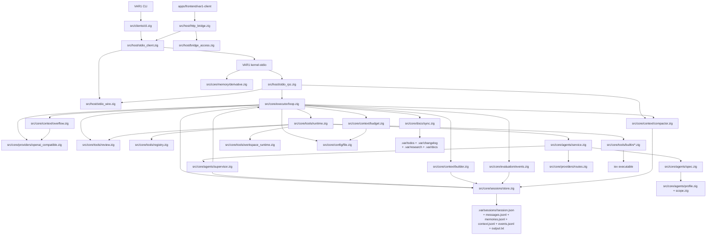
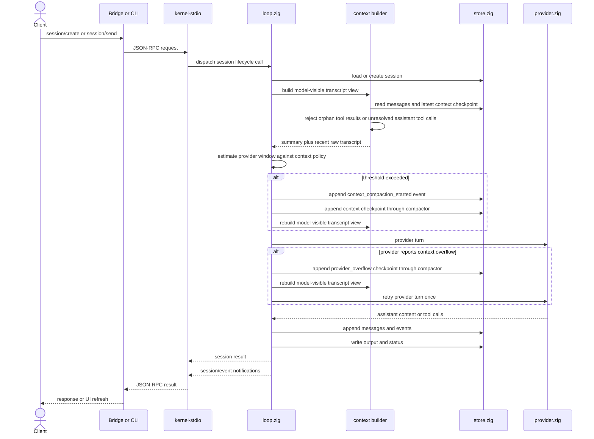
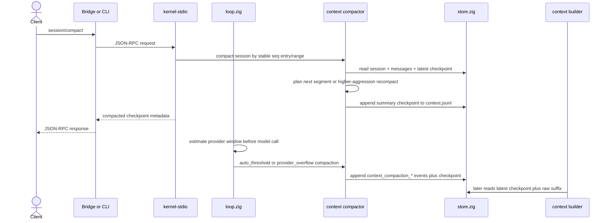
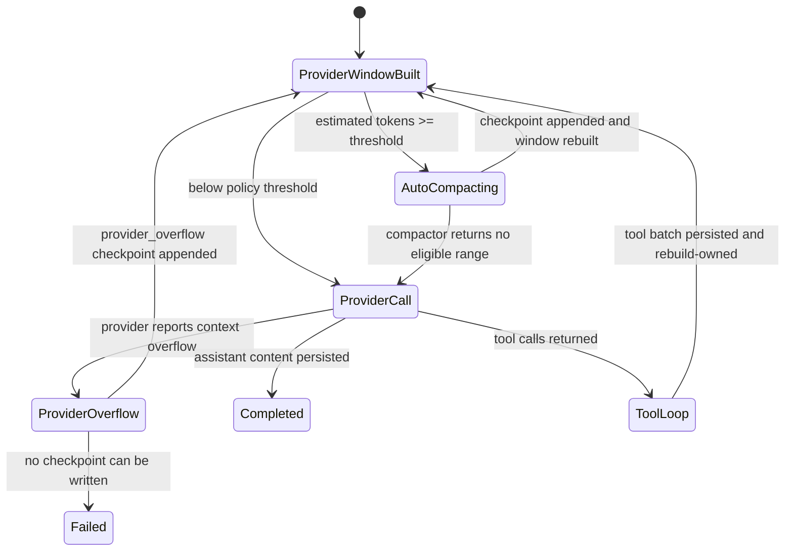
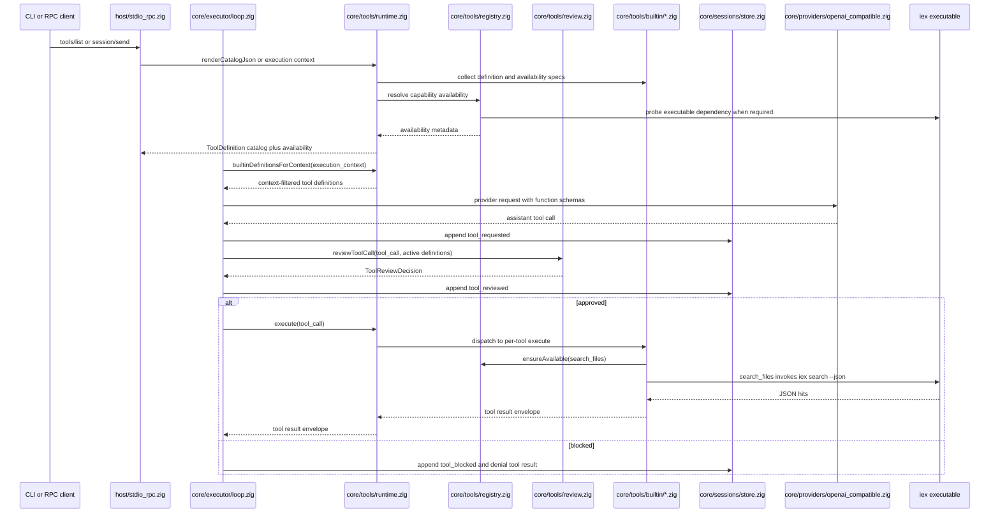
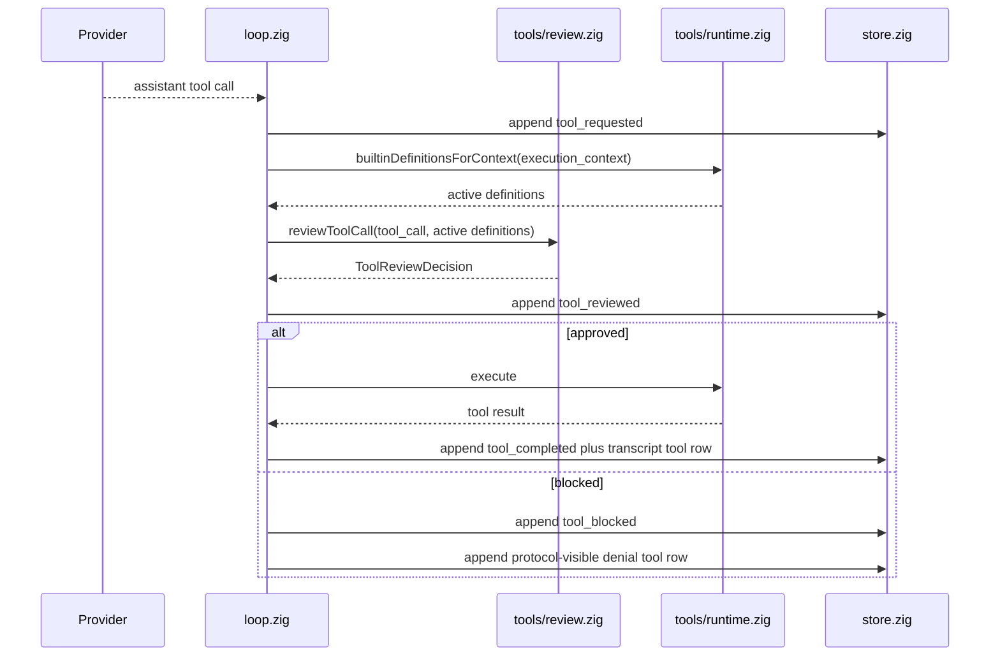
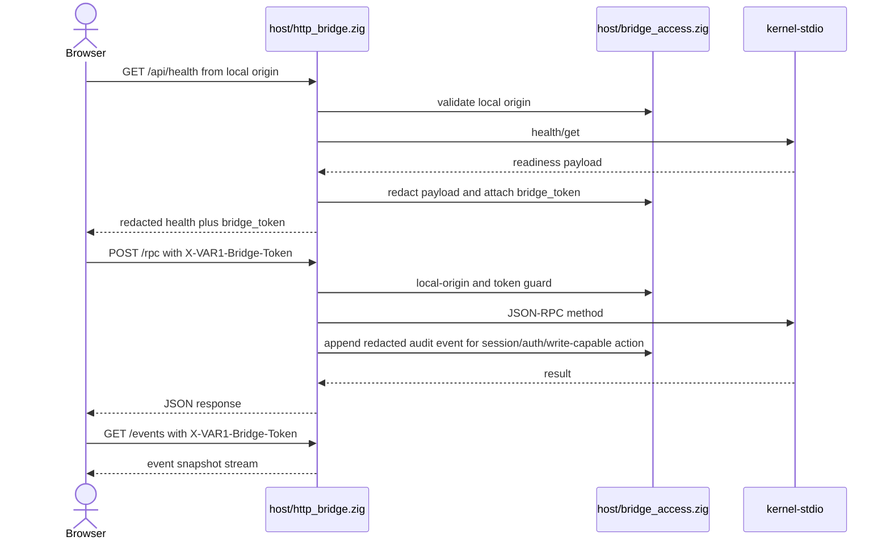
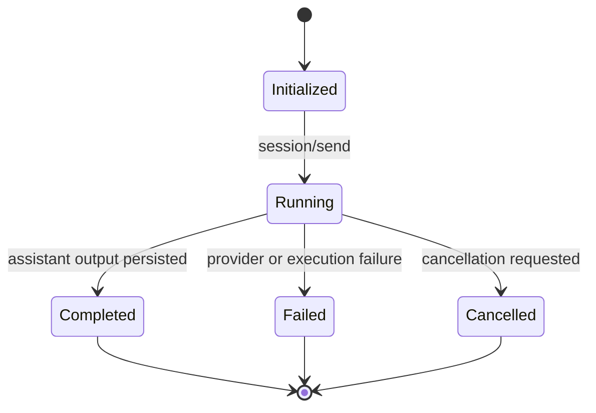

# VAR1 Architecture

This is the canonical architecture map for the current `VAR1` agent-session runtime.

## Architecture lock

- one execution primitive: session
- one durable source of truth: `.var/sessions/<id>/`
- one canonical host protocol: JSON-RPC 2.0 over stdio with Content-Length framing
- one local bridge surface for browser clients: `/rpc`, `/events`, `/api/health` with token-gated RPC/event access
- one executable name: `VAR1`
- one hidden host mode: `kernel-stdio`
- one external browser client: `apps/frontend/var1-client`

## Runtime slice

## Session message flow

## Context compaction flow

Manual and automatic compaction share the same primitive. The manual RPC path is gated by `context.manual_compaction`; the executor path is gated by `context.auto_compaction`, `context.context_window_tokens`, `context.compact_at_ratio`, and `context.reserve_output_tokens`. Provider overflow recovery is separately gated by `context.retry_on_provider_overflow` and retries one provider call after a real checkpoint is written. Checkpoint planning does not split assistant tool-call batches; if the proposed raw suffix would start at a tool-result row, the compacted segment is moved back so the assistant tool-call message and its tool results remain together in model-visible history.

The context builder also validates OpenAI-compatible tool-call adjacency before any provider dispatch. An assistant message with tool calls must be followed by matching tool-result rows in assistant source order; orphan tool rows and unresolved assistant tool-call tails fail closed as transcript integrity errors. This keeps `.var/sessions/<id>/messages.jsonl` append-only while preventing corrupt or crash-interrupted ledgers from becoming malformed model-visible context.

The executor keeps a preserved in-memory suffix only for non-durable internal continuations. After a complete assistant tool-call batch and its tool-result rows are appended to `messages.jsonl`, ownership transfers back to the context builder. Provider-overflow recovery and threshold compaction therefore rebuild durable tool context from the session ledger instead of replaying both the ledger copy and an executor-local copy into the same provider retry payload.

## Tool initialization flow

Tool definitions are schema-first. The shared shape lives in `shared/types.zig` as `ToolDefinition { name, description, parameters_json, review_risk, example_json, usage_hint }`. Per-tool modules under `core/tools/builtin/` own their definition, review risk, availability contract, and execute path. The registry resolves availability from module-owned names/specs instead of duplicating string branches. Provider request construction, CLI catalog export, RPC catalog export, review classification, prompt guidance, and failure repair hints derive from those module-owned metadata surfaces. Backend primitives are not agent tools until this metadata-and-dispatch path exists.

`search_files` is the content-search tool. It declares an `external_command("iex")` dependency, resolves the workspace path in Zig, then invokes `iex search --json --max-hits ...` through the command-runner boundary. The advertised pattern contract is native IX/IEX expression syntax (`lit:needle`, `re:TODO|FIXME`, `lit:a || lit:b`), not rg/grep flag emulation. `list_files` is the native Zig path-discovery tool and does not shell to `iex`. Installing `VAR1` therefore requires a real `iex` executable for content search; when it is absent, catalog availability reports `search_files` as unavailable and execution fails early with `ToolUnavailable`.

## Capability governance flow

The review gate is a kernel state transition, not a copied reviewer-agent architecture. Read-only tools receive review evidence and continue through the existing dispatch. Write-capable, workspace-state, and delegation tools are classified from active `ToolDefinition.review_risk` metadata before execution. Tool names absent from the active catalog, including context-unavailable tools, are denied before dispatch and returned to the provider as `ToolReviewBlocked`, preserving the OpenAI-compatible tool-call protocol.

Delegation is validated at one catalog-first agent boundary. In root orchestrator mode, `agents {}` must precede launch or configuration mutation. `launch_agent` accepts one `{ context, tasks[] }` batch whose task ids must come from that hot-loaded catalog. `core/agents/spec.zig` resolves editable personas over compiled execution-kind and capability-profile floors; custom ids must inherit through `extends`, so config cannot grant arbitrary tools or provider credentials. `configure_agent` validates and atomically replaces `config.json`; the next discovery or launch reads the new registry. Child prompts contain only the selected private capsule, explicit shared context, finite task, and output contract. The parent transcript is never copied into a child window.

Derivative memory and evaluator evidence are deliberately non-authoritative. `src/core/memory/derivative.zig` requires `session_id`, `source_seq_start`, and `source_seq_end`, and rejects transcript replay-shaped payloads. `src/core/evaluation/events.zig` appends redacted heartbeat/evaluator events with evaluator mutation forbidden. RecursiveMAS latent transfer, GRASP gradients, dynamic markets, autonomous background evolution, exact tokenizer integration, and plugin auto-discovery remain unsupported behavior until there is a tested contract for cancellation, idempotency, cold-start recovery, and lifecycle ownership.

## Bridge access flow

The bridge binds to `127.0.0.1` by default. CORS allows only explicit local HTTP origins; direct-file `Origin: null` callers are rejected so bridge access remains bound to a local browser origin. `/rpc` and `/events` require the health-issued bridge token; `/api/health` is the handshake route. `host/bridge_access.zig` owns access policy, sensitive-field and secret-shaped value redaction for health/error/RPC/event payloads, audit classification, and append-only `var1.bridge_audit.v1` emission to `.var/audit/bridge.jsonl`; `host/http_bridge.zig` owns the route transport. Audit persistence happens before audited session/auth/write-capable RPC dispatch, so an audit write failure blocks the action instead of creating unaudited state.

## Session state machine

## Durable contract

Every session directory contains:

- `session.json`
- `messages.jsonl`
- `memories.jsonl`
- `context.jsonl`
- `events.jsonl`
- `output.txt`

`messages.jsonl` is the complete append-only transcript. `memories.jsonl` is the session-only append ledger for compact source-linked facts, decisions, preferences, invariants, and lessons; repeated topics supersede earlier values and forget operations append tombstones. `context.jsonl` is compact checkpoint history written by the context compactor and used by the context builder to create model-visible history without rewriting transcript history. Each checkpoint marks the covered source sequence range, the next raw `first_kept_seq`, `compacted_entry_count`, and `aggressiveness_milli`, so compaction can advance one JSONL entry at a time or recompact an existing range when a stronger slider value is requested.

`$VANTARI_HOME/config.json` is the canonical non-secret policy file. Its typed sections own runtime limits, wire API selection, role routing, editable agent definitions, context policy, prompt paths, and supported environment-style overrides. Built-in agent rows may tune persona/condition/route/budgets or be disabled; custom ids must inherit a compiled capability floor. `$VANTARI_HOME/auth.json` is the sibling credential/provider ledger. API keys, OAuth tokens, account identity, and active-provider state never move into config output. Nested/AppData auth paths are one-time migration inputs; `settings.toml` is no longer a runtime reader. The Windows installer preserves valid config byte-for-byte and backs up plus materializes the current schema only when the retained file fails validation.

`src/core/prompts/` owns the model-presented prompt envelope. When no project prompt override is configured, it uses compiled system/developer layers. When an override path is configured, the file must exist and contain non-whitespace content; missing or empty configured prompt layers fail closed. The builder then injects the hidden runtime guardrail layer and appends the live catalog plus a runtime-owned burst/checkpoint contract. Long work interleaves one bounded observable step, one tool/delegation action batch, evidence inspection, and one compact checkpoint naming changed state, proof, blocker or residual risk, and next action. The assistant checkpoint is persisted in `messages.jsonl`, included by later context rebuilds, and never requests private chain-of-thought. A checkpoint does not terminate the run; the loop continues until terminal proof or a named blocker. Provider transport remains OpenAI-compatible by sending the resulting envelope as a system-role message while preserving internal/system/developer/tool boundaries inside the prompt text.

`store.ensureStoreReady(...)` creates the canonical sessions directory and initializes process-local sequence state. It never scans or rewrites existing `session.json` records. Explicit migrations own schema changes; this prevents startup cost from scaling with session count and prevents mixed-version processes from erasing additive fields they do not understand.

## Role-routed agent execution

`core/agents/spec.zig` owns stable specialist identity and hot-loads `config.json.agents.definitions`. An `AgentSpec` fixes execution kind, capability profile, route role, execution ceilings, recursion policy, and output contract. Built-in rows may be tuned or disabled; a custom id must extend one built-in floor. Operator configuration may remap provider, model, wire API, thinking mode, and context/output budgets through `core/providers/routes.zig`; it cannot weaken the inherited execution kind or capability profile.

`core/agents/service.zig` validates one `{ context, tasks[] }` batch, resolves routes, persists secret-free execution receipts, then admits the group to `core/agents/supervisor.zig`. The supervisor owns one fixed `std.Thread.Pool`, O(1) group/parent indexes, a completion condition, cancellation, terminal-event ordering, and exactly-once convergence. Healthy wait/status paths do not scan `.var/sessions`; ledger traversal is an explicit cold-start recovery path.

`core/executor/loop.zig` parks a waiting parent on the supervisor condition without a provider call. The first unconsumed terminal child wakes the parent; the service appends that child's convergence record exactly once, rebuilds through the context compiler, and permits the next routing/synthesis turn while unfinished siblings remain supervised. A parent cannot emit terminal output while any owned child remains active. Full specialists execute as ordinary isolated VAR1 child sessions. Tool-free `model_task` specialists use one provider turn and validate their supplied output schema without acquiring a second transcript or tool runtime.

Child assistant/reasoning deltas and tool transcripts stay in the child ledger. The parent event spine receives only bounded control events: group start, admission, queue, start, material progress/wait, child terminal, group terminal, and convergence. Every child `session.json` keeps a heap-owned immutable execution receipt containing the secret-free resolved agent, route, model, wire API, budgets, group, and branch identity; explicit checked JSON decoding preserves that receipt across optimized status rewrites and cold recovery. CLI, stdio, and TUI consume the same projection. The TUI renders Search, Explore, Agents, and To-dos through one group/item grammar with `[ ]`, `[>]`, `[x]`, `[!]`, `[-]` markers and `|--` / `` `--`` child rails; no second status bus exists.

## Module ownership

- `src/shared/types.zig`
  shared runtime types and session contracts
- `src/shared/fsutil.zig`
  bounded filesystem helpers for text reads, parent-directory creation, and cross-platform path normalization
- `src/core/sessions/store.zig`
  canonical session storage
- `src/core/executor/loop.zig`
  kernel-owned execution loop
- `src/core/context/builder.zig`
  sole owner for turning session storage into provider-ready transcript messages
- `src/core/context/compactor.zig`
  sole owner for planning and writing summary checkpoints from stable message sequence entries/ranges
- `src/core/context/budget.zig`
  approximate provider-window token estimator and compaction-threshold calculator
- `src/core/context/overflow.zig`
  provider-error classifier for explicit context-window overflow, excluding rate-limit and availability failures
- `src/core/config/file.zig`
  canonical `$VANTARI_HOME/config.json` loader, default materialization, environment precedence, and validation
- `src/core/config/settings.zig`
  retained TOML parser tests only; live policy reads route through `config/file.zig`
- `src/core/prompts/builder.zig`
  sole owner for assembling internal guardrails, user-editable system/developer prompt layers, and the live tool-use contract
- `src/core/tools/`
  typed tool socket namespace, built-in module registry/runtime, pre-dispatch review, availability resolver, command-backed search dispatch, and workspace-state helpers
- `src/core/agents/spec.zig`
  stable specialist ids, execution-kind floors, capability profiles, route roles, budgets, and output contracts
- `src/core/agents/service.zig`
  batch validation, route/receipt persistence, supervisor admission, cold recovery, and convergence integration
- `src/core/agents/supervisor.zig`
  fixed-pool group execution, O(1) live indexes, condition-based wait, cancellation, terminal ordering, and exactly-once convergence
- `src/core/agents/profile.zig` + `scope.zig`
  runtime-enforced tool-class profiles and scoped delegation validation
- `src/core/providers/routes.zig`
  secret-bearing route resolution plus secret-free provider/model/wire/thinking identity for execution receipts
- `src/core/memory/`
  canonical two-scope memory schema, append stores, bounded recall compiler, source evidence, and derivative-memory validation without duplicating `messages.jsonl`
- `src/core/evaluation/`
  redacted heartbeat, evaluator, and unsupported-behavior event append helpers
- `src/core/plugins/`
  plugin manifest/socket contracts only; plugin implementations do not live in core
- `src/shared/protocol/types.zig`
  JSON-RPC methods and payload shapes
- `src/host/stdio_wire.zig`
  canonical Content-Length frame decoder/encoder and JSON-RPC envelope rendering
- `src/host/stdio_client.zig`
  local kernel child-process lifecycle, request/notification transport, response correlation, and monotonic notification queue
- `src/host/stdio_rpc.zig`
  kernel-side JSON-RPC dispatch, request workers, session subscriptions, and response emission
- `src/host/bridge_access.zig`
  local HTTP bridge access policy for origin checks, token validation, key-and-value redaction, audit classification, and durable audit event emission
- `src/host/http_bridge.zig`
  local HTTP bridge route transport for `/rpc`, `/events`, and `/api/health`
- `src/clients/cli.zig`
  thin protocol-backed CLI
- `src/clients/tui_chat.zig`
  terminal projection over monotonic `session/event` notifications with burst draining and adaptive frame backpressure
- `apps/frontend/var1-client`
  external static browser client over `/api/health`, `/rpc`, and `/events`

## Pluggability boundary

`core/` contains kernel capability domains, not plugin names. The current socket hierarchy is intentionally small:

- `core/context/` owns model-visible transcript assembly, checkpoint generation, budget estimation, and provider-overflow classification.
- `core/tools/` owns tool socket contracts, per-tool built-in modules, catalog availability, and runtime dispatch.
- `core/plugins/` owns manifest validation for future plugin roots.

Future plugin implementations should live outside `core/` and register through typed sockets. Auto-discovery is not enabled until manifest validation, explicit enablement, deterministic load order, and lifecycle tests are in place.

## Validation lane

The current validation lane should always prove these slices together:

- `build test`
- `health`
- direct `run`
- delegated child-session `run`
- bridge root response is text, not embedded HTML
- bridge rejects removed facade routes
- bridge rejects unapproved origins and tokenless RPC/event access
- bridge-visible RPC and event payloads share the bridge redaction primitive
- audited bridge RPCs append redacted audit records to `.var/audit/bridge.jsonl`
- tool catalog reports availability metadata
- tool calls record `tool_reviewed` before `tool_completed` or `tool_blocked`
- file mutation tools declare and enforce bounded generated payloads before write side effects
- agent discovery precedes launch/config mutation; hot-loaded custom ids inherit compiled capability floors
- role-routed agent batches prove bounded 1/5/20/100 admission, zero provider-spin waiting, O(1) healthy lookup, exact convergence, cancellation, and receipt recovery
- parked parents wake on the first terminal child, compile each ready result once, and remain non-terminal while siblings are active
- parent child-control events remain bounded while assistant/reasoning deltas stay in child ledgers
- TUI activity families share one nested checkbox/rail projection driven by typed events
- derivative memory rejects transcript replay while citing source sequence ranges
- heartbeat/evaluator evidence appends redacted non-mutating events
- auto and provider-overflow compaction write observable checkpoint/event records
- session JSONL ledgers tolerate malformed and partial suffix rows without rewriting append-only history
- context reconstruction reads `session.json`, latest valid `context.jsonl` checkpoint, and `messages.jsonl` through `core/context/builder.zig`
- explicit prompt-layer configuration fails closed when the configured file is missing or empty
- the runtime-owned burst/checkpoint/continuation contract survives project prompt overrides
- shared text-file reads are bounded by `fsutil.max_text_file_bytes` instead of inheriting unbounded allocator reads
- shared text-file writes commit through Zig `AtomicFile`, so canonical metadata updates avoid truncate-before-write corruption windows
- health preflights stale local `VAR1.exe` process diagnostics before build/test gates
- external client exists at `apps/frontend/var1-client`

Latest local Windows validation on 2026-05-08:

- `.\scripts\zigw.ps1 build test --summary all` -> `416/416 tests passed`
- `.\scripts\health.ps1` -> `status: ready`
- `.\zig-out\bin\VAR1.exe tools --json` -> `search_files` includes `external_command` dependency availability for `iex`
