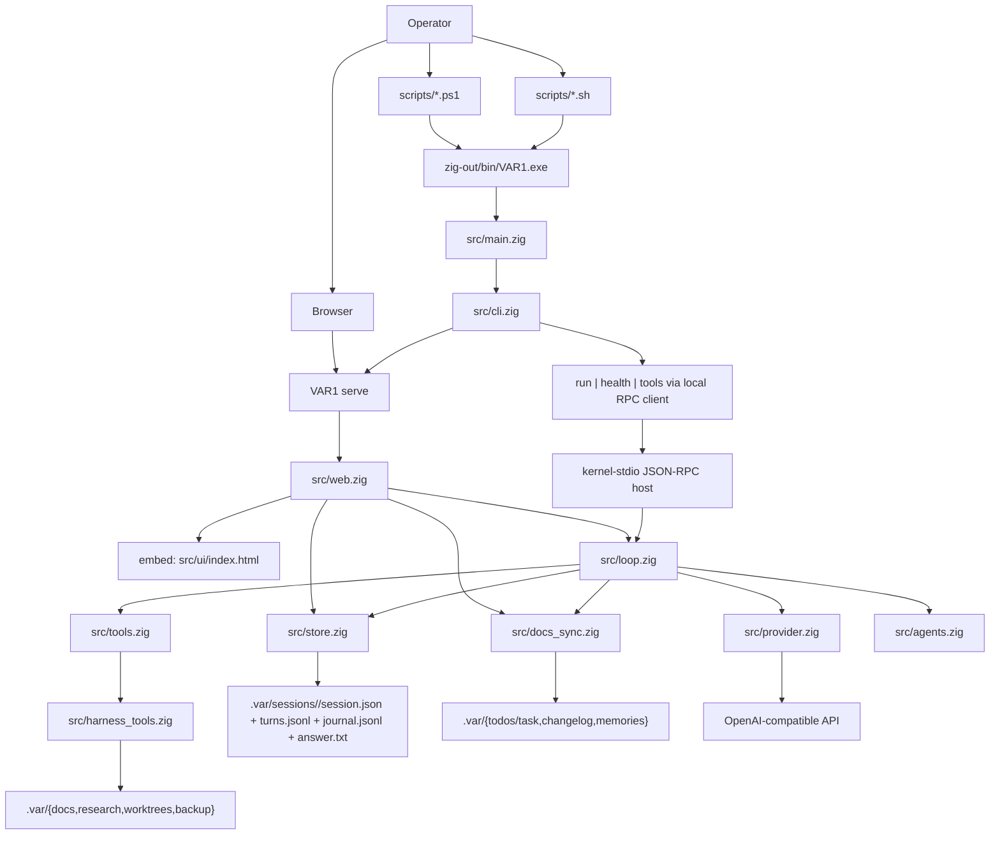
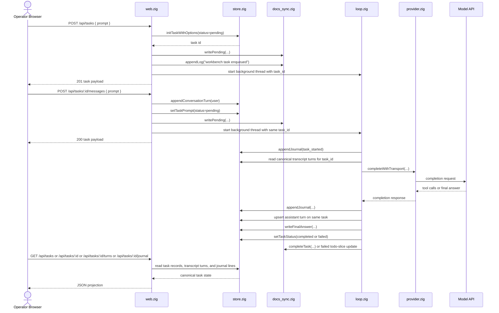
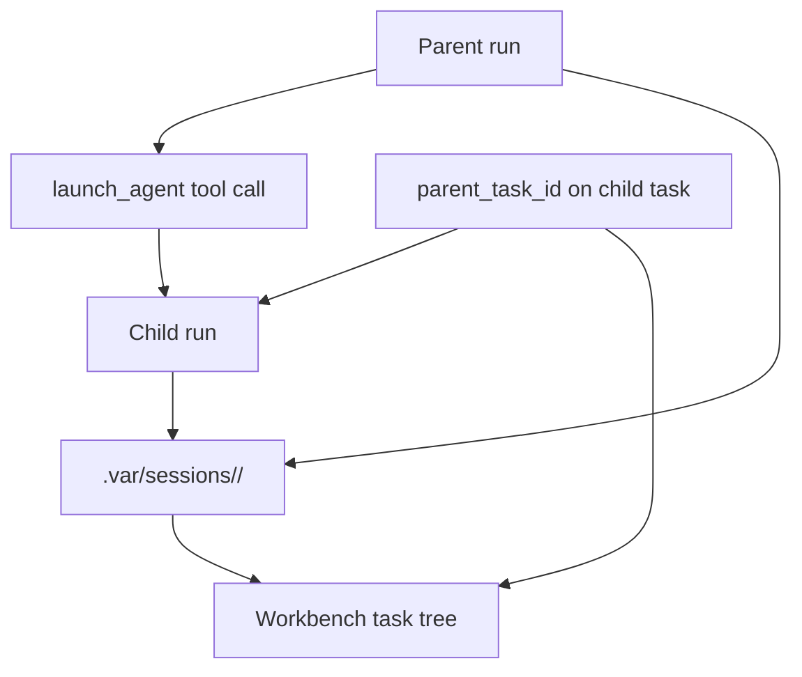
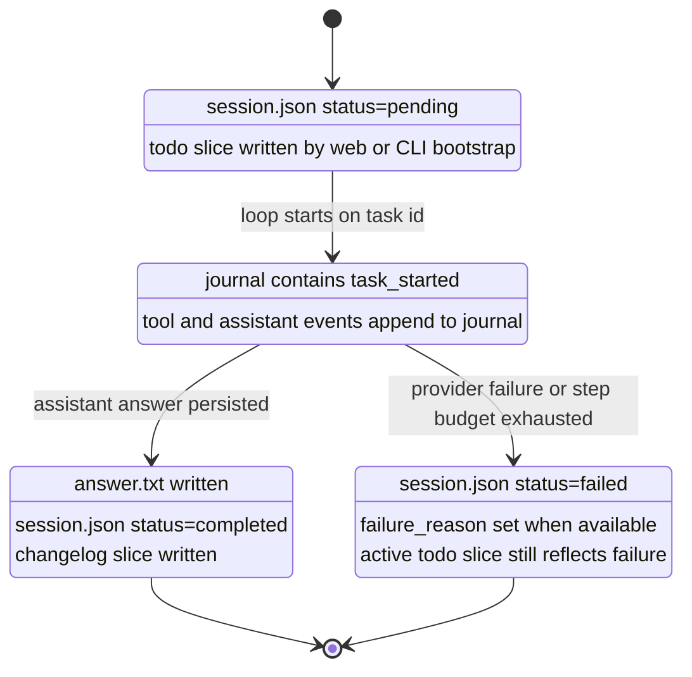

# VAR1 Architecture

This document is the canonical architecture map for the current `VAR1` runtime. It describes the implementation that exists today.

## Architecture Lock

- one execution primitive: run and task
- one durable source of truth: `.var/sessions/<task-id>/`
- subagent = normal child run with `parent_task_id`
- operator session/chat = same canonical task id plus `turns.jsonl`
- canonical local command boundary for `run`, `health`, and `tools` is JSON-RPC 2.0 over stdio with Content-Length framing (`kernel-stdio`)
- root harness tools operate inside `.var/` only, are exposed only for harness-relevant tasks, and do not create a second state system
- workbench = thin projection over canonical task state
- background web execution reuses `loop.runPromptWithOptions(...)`
- UI refresh is pull-based polling, not server-pushed streaming

## 1. Runtime Slice



## 2. Workbench Request Flow



## 3. Delegation Model



All durable child identity, progress, and final state are recoverable from canonical task records. `src/agents.zig` is spawn and control glue over that canonical state, not a second registry.
Child supervision snapshots now include lifecycle and heartbeat metadata (`LIFECYCLE_STATE`, `HEARTBEAT_*`, `NEXT_PARENT_ACTION`) so parent runs can reason about done, waiting-for-input, processing, and errored states without introducing another registry.

## 4. Task State Machine



## 5. Workbench Surface

The embedded workbench in `src/ui/index.html` stays intentionally small, but it now reads as a clean local single-user operator surface:

- top bar: connection state, workspace root, and active model
- left rail: newest-first task tree with child indentation, counts, and focused status filters
- main thread: task record, latest event, child runs, final answer, and a merged transcript-plus-journal timeline from the same task id
- bottom composer: create a new canonical task or resume a completed session by selected or pasted id on the same canonical task record
- action row: refresh, copy answer, and resume failed or pending runs on the selected canonical task
- refresh transport: `setInterval(..., 1800)` plus request cancellation on overlapping browser fetches

There is no browser-only state model. The selected task and hydrated panes are read models over the task API.

## 6. Resumability Boundary

`VAR1` resumes canonical tasks and can continue operator turns on that same task id, but it still does not introduce a separate chat-session runtime.

Supported:

- `run --task-id "<task-id>"`
- `POST /api/tasks/:id/resume`
- `POST /api/tasks/:id/messages`
- journal and final-answer inspection for stopped tasks
- replaying prior transcript turns from `turns.jsonl` on the same task id

Forward-only boundary:

- missing `turns.jsonl` is treated as an empty transcript instead of reconstructing from legacy lineage
- no legacy lineage fields are persisted in canonical records

Not supported:

- replaying the internal tool transcript back into the model
- a second persisted conversation object
- live websocket streaming

## 7. Module Ownership

- [src/cli.zig](./src/cli.zig) - CLI parsing and top-level command dispatch
- [src/web.zig](./src/web.zig) - HTTP route layer, embedded UI serving, task API projection
- [src/loop.zig](./src/loop.zig) - canonical model and tool loop
- [src/store.zig](./src/store.zig) - task records, canonical transcript turns, final answers, newest-first listing, and journal reads
- [src/docs_sync.zig](./src/docs_sync.zig) - `.var` readable tracking gate for run log, memories, active todo slices, and changelog slices
- [src/provider.zig](./src/provider.zig) - native HTTP and TLS transport to OpenAI-compatible APIs
- [src/protocol_types.zig](./src/protocol_types.zig) - canonical JSON-RPC method names, state labels, and method payload shapes
- [src/stdio_rpc.zig](./src/stdio_rpc.zig) - Content-Length framed stdio JSON-RPC host plus the local CLI child-process client
- [src/tools.zig](./src/tools.zig) - top-level tool catalog, file tools, and delegation dispatch
- [src/harness_tools.zig](./src/harness_tools.zig) - canonical root-harness tool runtime for init, domain-state, backup, worktree, and instruction-ingestion actions
- [src/agents.zig](./src/agents.zig) - child-run spawn and supervision over canonical task state
- [src/ui/index.html](./src/ui/index.html) - single-file workbench

## 8. Validated Windows Operator Lane

PowerShell is the native operator path for this checkout.

Validated commands:

```powershell
Set-Location E:\Workspaces\01_Projects\01_Github\VANTARI-ONE\apps\backend\variant-1
.\scripts\zigw.ps1 build test --summary all
.\zig-out\bin\VAR1.exe health --json
.\scripts\health.ps1
.\scripts\local_gemma_smoke.ps1
```

Validated outcomes in the current repo state:

- `.\scripts\zigw.ps1 build test --summary all` is green at `58/58 tests passed`
- Windows build succeeded at `3/3 steps`
- `.\zig-out\bin\VAR1.exe health --json` emitted the structured readiness payload with `ok`, `model`, `workspace_root`, and `openai_base_url`
- `.\scripts\health.ps1` printed the plain-text readiness snapshot without sending a model request
- `.\zig-out\bin\VAR1.exe tools --json` now advertises the canonical `search_files` contract backed by `iex`, while keeping `rg_search` only as a compatibility alias inside the runtime
- `.\zig-out\bin\VAR1.exe help serve` now exposes `GET /api/tasks/:id/turns` and `POST /api/tasks/:id/messages` in the shipped operator help surface
- `.\scripts\local_gemma_smoke.ps1` is green in the current repo state, including direct `run --prompt`, delegated run functional acceptance of `3`, and workbench route validation on canonical task `task-1776886949200-b993269644a3f80`
- last known Playwright sanity pass is from `2026-04-21` (`VAR1 Workbench`, no browser console errors)

## 9. Deliberate Boundaries

This slice does not add:

- a second session runtime
- browser-owned durable state
- a websocket event bus
- a separate product database
- a second root harness ledger outside `.var/`
- any ownership path outside `.var/sessions/<task-id>/` for durable run state

The productization move was to expose the canonical harness through a web projection, not to invent a second system.
